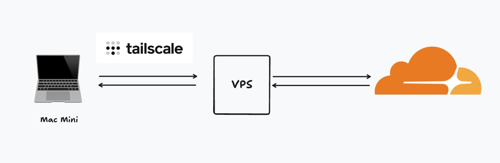
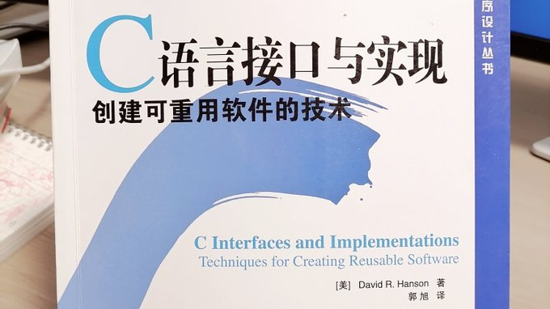

# 数学是一个词

这是季刊《总统家族》杂志的专栏。

**这是结城宏写给喜欢书本但数学稍弱的小学生的“信”** 。

 你好。

致正在阅读这篇文章的你。

你是小学生吗？

你读这篇文章是因为你的父母告诉你读这篇文章吗？不，但这并不重要。

“言语”是某人用来传达某事的东西。

当你想出一些美妙的东西时，你想告诉别人。就像， **“你知道，我正在考虑这个”。**这就是你使用言语的时候。

数学和算术也是如此。如果你想准确地向某人传达算术中出现的数字和数量，最好使用数学公式来更准确地传达信息，而不是用随意的日语来传达信息。因为这正是公式的用途......

> https://mm.hyuki.net/n/n64e93dd7c35b

### 工具

- pdf 书籍下载：https://oceanofpdf.com/
- 写论文用到的工具分享 
  - 人工智能工具： 
    - https://kimi.moonshot.cn/
    - https://www.deepseek.com/
  - 文献综述： [https://paperdigest.org](https://t.co/tE0ZskE6V0) 
  - highcharts gpt, 给出数据，使用提示词工程，让 GPT 借助 highcharts 工具帮忙画出图片。
    - https://www.highcharts.com/chat/gpt/

- AI文生图：https://nv-sana.mit.edu/
- An LLM-powered knowledge curation system that researches a topic and generates a full-length report with citations.
  - https://storm.genie.stanford.edu/
- 一个集记单词与打字练习为一体的工具：https://github.com/RealKai42/qwerty-learner
- 🐱 猫猫表情包生成器：https://orangesai.com/catemoji/
- 一款简单易用且强大的桌面下载工具：https://github.com/KurtBestor/Hitomi-Downloader
- 内网穿透

内网穿透方案之tailscale+cloudflare tunnel 

很多homelab玩家拿到机器遇到的第一个问题就是怎么把服务部署到公网。 

有的人会选择frp，但考虑到国内服务器带宽和价格的情况下frp效果实在太差。也有人使用tailscale这种p2p方案，但这种并没有把服务暴露到公网。这里分享一个我的解决方案。 

首先你需要在本地机器和一台海外vps上都部署tailscale并且完成登录。关于vps的选择，推荐使用新加坡的vps（可以做到一机多用，能够正常代理ChatGPT，大多直连效果也不错），不推荐使用国内的vps，因为后面还要连接cloudflare。 

此时你可以在tailscale中看到本地机器的tailscale ip。 

之后在vps部署cloudflare tunnel，支持docker和主流操作系统安装。 

在cloudflare tunnel中添加tailscale中本地机器的内网ip，映射到域名上。 

在这种方案下，你可以同时保护本地机器、vps的IP不暴露，又可以保证服务稳定性（国内直连cloudflare tunnel稳定性很差），同时不会牺牲很多速度。 

此外，你可以使用国内服务器自部署derp节点（tailscale的中继节点）来保障服务的稳定性。

- https://refly.ai/

- https://www.3d-map-generator.com/
  - 公众号：地图的世界
- GIF 图片制作：https://imgflip.com/gif-maker

- 一款电子书转有声书 AI 工具：ebook2audiobook：https://github.com/DrewThomasson/ebook2audiobook
- 为 Prompt 工程化打造的编程语言 APPL 宣布开源
  - https://github.com/appl-team/appl
- 基于 APPL 实现 Prompt 自动优化的 ERM 算法
  - https://github.com/appl-team/reppl/tree/main/prompt-optimization/
- 快速画草图软件 tldraw
  - https://computer.tldraw.com/
- 邮件：https://github.com/arikchakma/maily.to

- [拼图酱](https://apps.apple.com/cn/app/%E6%8B%BC%E5%9B%BE%E9%85%B1-%E6%B2%BB%E6%84%88%E7%B3%BB%E6%8B%BC%E6%8E%A5%E6%B5%B7%E6%8A%A5%E4%BF%AE%E5%9B%BE%E8%BD%AF%E4%BB%B6/id1121943475)

- [个人知识管理](https://github.com/siyuan-note/siyuan)

- [人脸识别与分析库](https://github.com/serengil/deepface)

- https://github.com/AlexxIT/go2rtc

- OpenAI 开源了一款语音自动识别系统，支持多语言(包含中文)，同时提供了API接口。可以用来为视频自动生成字幕、实时将会议内容转录，语言学习等
  - https://github.com/openai/whisper

- 分享一个网站能轻松免费学习一门新语言
  - https://www.lingohut.com/zh

- 将pdf文件转成 markdown 格式的工具
  - https://github.com/YOYZHANG/open-source-ai-weekly

- Run Linux desktop in a browser via Docker
  - https://www.linuxserver.io/
- 【工具】Upload Files to Cloudflare R2：https://r2uploader.com/

- 【工具】一个科研助手：OpenScholar：https://github.com/AkariAsai/OpenScholar

- 一个开源免费的文本转语音 API：openai-edge-tts：https://github.com/travisvn/openai-edge-tts
- https://21st.dev/
- PPT Agent: https://github.com/icip-cas/PPTAgent
- [**一款实时语音转文字工具：RealtimeSTT**](https://github.com/KoljaB/RealtimeSTT)

- [来自 HuggingFace 的小语言模型在线教程更新了 Agent 相关的内容。直接 github 上可以看！这个教程由于基于足够小的模型 SmolLM2（135M，360M，1.7B），所以可以在笔记本和台式机上直接运行](https://github.com/huggingface/smol-course)

- [免费API接口](https://github.com/public-apis/public-apis)

- TTS Arena 排行榜
- Campsite：https://www.campsite.com/
- h5 播放器：https://github.com/sampotts/plyr
- 视频去水印工具：https://shorturl.at/HouqN

- 在线简历生成工具：https://github.com/Arman19941113/dnd-resume

- AI 工具集合

 

- 数据库集合操作

​	

- 视频下载工具：https://github.com/KurtBestor/Hitomi-Downloader

- 头像制作：https://notion-avatar.vercel.app/zh

### 书籍&课程推荐&论文

- 重读这本神书，Thermoinfocomplexity

- 计算机工作原理，[**Exploring How Computers Work**](https://www.youtube.com/playlist?list=PLFt_AvWsXl0dPhqVsKt1Ni_46ARyiCGSq)

- freeCodeCamp 编程课程平台
  - https://www.freecodecamp.org/chinese/
  - https://github.com/freeCodeCamp/freeCodeCamp
- PostgreSQL 内参：深入解析运行原理
  - https://postgres-internals.cn/
- Buffett’s Early Investments
- [Advanced C++ Workshop](https://www.youtube.com/playlist?list=PL1tk5lGm7zvT5cxiXM6H4SRH-QJCVFbmh)
- 【paper】[Foundations of Large Language Models](https://arxiv.org/pdf/2501.09223)

- 【教程】[扣子保姆级教程|带你手把手搭建游网络热点洞察Bot](https://www.bilibili.com/video/BV1D9cdeME57/?vd_source=754fbd1de98e8aedc3f7d66dd447ea50)

- 【课程】[Writing Compilers for Fun from Scratch](https://www.youtube.com/playlist?list=PLysa8wRFCssxGKj_RxBWr3rwmjEYlJIpa)

- 【书籍】[Hands-On Network Programming with C 源码](https://github.com/PacktPublishing/Hands-On-Network-Programming-with-C)

- 【系统设计】[系统设计资源](https://github.com/ashishps1/awesome-system-design-resources)
  - https://github.com/karanpratapsingh/system-design
  - https://github.com/donnemartin/system-design-primer
  - https://roadmap.sh/system-design
  - https://github.com/ByteByteGoHq/system-design-101
  - https://github.com/karanpratapsingh/system-design
  - https://github.com/systemdesign42/system-design

- 【课程】[**Making an OS (x86)**](https://www.youtube.com/playlist?list=PLm3B56ql_akNcvH8vvJRYOc7TbYhRs19M)

- 【课程】[Operating System in 1,000 Lines](https://operating-system-in-1000-lines.vercel.app/en/)
  - https://github.com/nuta/operating-system-in-1000-lines

- 【课程】[**Building an OS**](https://www.youtube.com/playlist?list=PLFjM7v6KGMpiH2G-kT781ByCNC_0pKpPN)

- 【课程】[Fast API Tutorial](https://www.youtube.com/playlist?list=PLqAmigZvYxIL9dnYeZEhMoHcoP4zop8-p)

- 【课程】[**Python FastAPI Playlist + testing + deployment**](https://www.youtube.com/playlist?list=PL8VzFQ8k4U1L5QpSapVEzoSfob-4CR8zM)

- 【书籍】Change Stuff and See What Happens
  - CSS in depth
  - CSS the Definitive Guide

- 【课程】Rust 中国公益免费训练营来了 

- 【课程】[Building a CPU](https://www.youtube.com/playlist?list=PLilenfQGj6CEG6iZ4TQJ10PI7pCWsy1AO)
- 【课程】[数学](https://x.com/swapnakpanda/status/1879574365542785115)

- 【书籍】[人人都在说谎](https://book.douban.com/subject/30384189//)

- 【书籍】[Deep-Learning-Books](https://github.com/letthedataconfess/Deep-Learning-Books)

- 【课程】[All Self-Paced Courses](https://learn.nvidia.com/en-us/training/self-paced-courses)

- 【课程】[数据结构](https://www.youtube.com/playlist?list=PLDV1Zeh2NRsB6SWUrDFW2RmDotAfPbeHu)

- 【书籍】[Think Python](https://allendowney.github.io/ThinkPython/)

- 【课程】[Web Server from Scratch in C](https://www.youtube.com/playlist?list=PLDqjvz44o_1Uj90bCt5K81NSlJhLUYG9e)

- 【课程】[游戏引擎构建](https://www.youtube.com/playlist?list=PLlrATfBNZ98dC-V-N3m0Go4deliWHPFwT)
- 【书籍】基于大模型的RAG应用开发与优化

- 【课程】[Introduction to Algorithms](https://ocw.mit.edu/courses/6-006-introduction-to-algorithms-spring-2020/)
  - [视频课程](https://www.youtube.com/playlist?list=PLUl4u3cNGP63EdVPNLG3ToM6LaEUuStEY)
- 【课程】[C++](https://www.youtube.com/playlist?list=PLlrATfBNZ98dudnM48yfGUldqGD0S4FFb)

- 【书籍】[Let's Build a Compiler, by Jack Crenshaw](https://compilers.iecc.com/crenshaw/)

- 【书籍】C语言接口与实现

   

### 好玩的事情

- ”树冠羞避” 现象
  - 摄于新西兰大陆以南 500km的最偏远的rata树林，摄影师乔治捕捉到了令人惊叹的“树冠羞避”（crown shyness）场景。 这是只在某一些树种才能观察到的现象，它们的树冠互不遮挡，从而形成一个沟状开口。  这种现象在同一种树间最为普遍，但是也偶在不同种树间发生。  关于为什么“树冠羞避”是一种适应性行为，存在着许多假说...

- 字体：https://picaq.github.io/sarasa/

- [he Steal Like An Artist Journal - Talk by Austin Kleon](https://www.youtube.com/watch?v=pktz3rPM2QI)

### 赚钱

- 写作赚钱
  - https://www.digitalocean.com/
  - https://www.contentturbine.com/freelance
  - https://www.agora.io/en/
  - https://neptune.ai/
  - https://longreads.com/
  - https://adevait.com/
  - https://uxbooth.com/
  - https://contentlab.io/
  - https://www.tutorialspoint.com/index.htm
  - https://airbyte.com/
  - https://www.civo.com/
  - https://draft.dev/

- 卖课
  - https://www.udemy.com/

### 产品

- 2025 年成为 AI 产品经理的 3 个步骤 
  - 每天体验一个 AI 工具的功能（如笔记），每天高强度使用，用手机写下亮点和缺点
  - 每天学习 10 分钟大语言模型（LLM）的基础知识，比如 Prompt 优化如何影响输出结果
  - 每天找一个朋友聊聊对 AI 笔记工具的看法，记录 1 条需求或痛点，形成用户需求表

- 继阿里云后，腾讯云也推出 200M 轻量服务器（内地¥40/月起），预计有限速但不限流量。
  - 对多地办公组网需求，这是低成本方案
  - 我现在用阿里云 200M 做国内组网中继节点，连接联通、电信家宽和移动网络均可跑满上行带宽。实测用来远程桌面、游戏串流、转发访问家里 Homelab 服务，体验都还行

- 系统设计：https://codemia.io/system-design

- 读书：https://3min.top/zh

### 推荐Blog

- https://osblog.stephenmarz.com/

- https://jyywiki.cn/
- 【文章】[How Unix Spell Ran in 64kB RAM](https://blog.codingconfessions.com/p/how-unix-spell-ran-in-64kb-ram)

- 【文章】[Understanding the .bss Segment in C Programming](https://chessman7.substack.com/p/understanding-the-bss-segment-in)

- 【文章】[The Illustrated Transformer](https://jalammar.github.io/illustrated-transformer/)

- 【文章】[Understanding LSTM Networks](https://colah.github.io/posts/2015-08-Understanding-LSTMs/)

- https://www.niceshare.site

- 【Blog】https://www.ruanyifeng.com/blog/

- 【文章】[MinMo: A Multimodal large Language Model for Seamless Voice Interaction](https://funaudiollm.github.io/minmo/)

- 【文章】[人人都能写英文博客](https://www.piglei.com/articles/everyone-can-write-eng-blog/)

- 【文章】[MLOps guide](https://huyenchip.com/mlops/)

- 【Blog】[瞎玩君](https://aoxuis.me/)

- 【文章】[2025年英语进阶：打开海外新机遇的最佳资源](https://bearliu.substack.com/p/2025-english-learning-resource)

- 【文章】[How to Crack System Design Interview in 2025 with Codemia.io?](https://medium.com/javarevisited/how-to-crack-system-design-interview-in-2025-with-codemia-io-9e42d41d0464)

- 【Blog】https://austinkleon.com/
- 【Blog】https://nav.al/
- 【Blog】https://fs.blog/

### 名人名言

- 形象一定要走在能力前面；不然你的能力很容易被低估。--罗素

- 顺着人性做事儿，逆人性提升自己。

### 纪录片

- [迷失东京](https://www.bilibili.com/bangumi/play/ep785324)

### AI 提示词工程

> 如何写提示词：
>
> Role: 什么角色
>
> Task：什么任务
>
> Format：输出内容格式

- https://github.com/langgptai/awesome-claude-prompts
- https://www.promptingguide.ai/zh
- https://platform.openai.com/docs/guides/prompt-engineering

- https://github.com/dair-ai/Prompt-Engineering-Guide
- https://cloud.google.com/discover/what-is-prompt-engineering
- https://github.com/K-Render/best-chinese-prompt
- https://github.com/PlexPt/awesome-chatgpt-prompts-zh
- https://github.com/langgptai/wonderful-prompts
- https://github.com/Vipuser2023/chatgpt-prompts-chinese
- [提示词](https://docs.google.com/spreadsheets/d/19jzLgRruG9kjUQNKtCg1ZjdD6l6weA6qRXG5zLIAhC8/edit?gid=352404979#gid=352404979)
