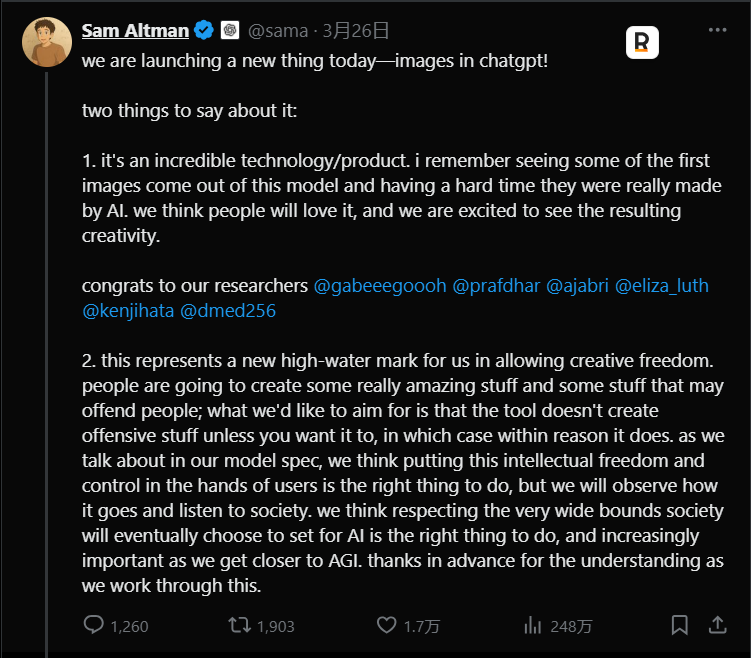
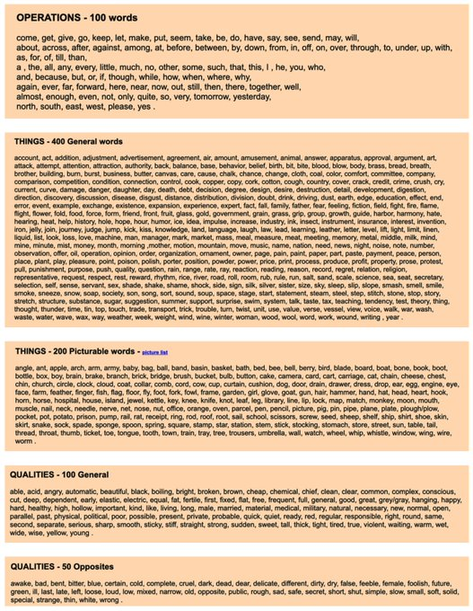
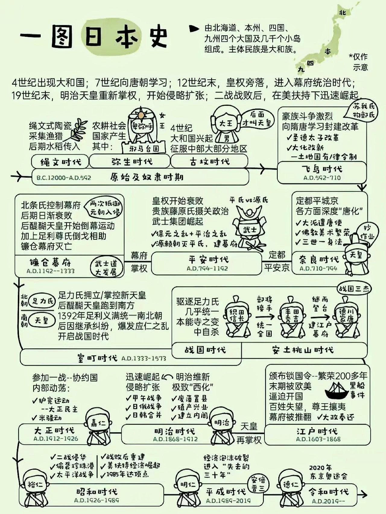

# we are launching a new thing today—images in chatgpt!

> https://openai.com/index/introducing-4o-image-generation/

## 工具

- See the CPU execution, Pipeline stages and Caches in action：https://ripes.me/
- 一个多平台直播流自动录制工具 · 基于 FFmpeg · 支持监控/定时/转码：https://github.com/ihmily/StreamCap
- Vecto3d，能够将任何 SVG 图标一键生成 3D 模型：https://github.com/lakshaybhushan/vecto3d
- 「图片像素化」工具：https://studioaaa.com/product/dither-boy/
- MLX is an efficient machine learning framework specifically designed for Apple silicon：https://github.com/ml-explore/mlx
- A free + OSS logo generator powered by Flux on Together AI：https://github.com/Nutlope/logocreator
  - https://www.logo-creator.io/
- 一款强大的跨平台番剧采集和在线观看开源应用：Kazumi：https://github.com/Predidit/Kazumi
- 一个由 AI 驱动的 UI 自动化 SDK：Midscene.js：https://github.com/web-infra-dev/midscene
  - https://midscenejs.com/zh/
- 兔子 API：https://api.tu-zi.com/
- 开源支付平台：https://github.com/juspay/hyperswitch
- 爆款标题分析：https://www.textimagecraft.com/zh/title-analysis
- 考公：https://saduck.top/
- 监控：https://github.com/zaunist/xugou
- 你需要做一个产品官网/企业网站/个人网站，可以试试这个开源的 AstroWind， 使用 Astro 5.0 + Tailwind CSS 开发：https://github.com/onwidget/astrowind
- Command line utility to extract clean html, markdown and metadata from web pages：https://github.com/kepano/defuddle-cli
- https://github.com/liaokongVFX/MCP-Chinese-Getting-Started-Guide
- https://github.com/martin226/vibe-draw
- 编程语言学习：https://www.freecodecamp.org/learn/
- https://github.com/Azzedde/paper_to_podcast
- 对于编程学习、新框架学习，可以直接去 [freecodecamp](https://www.youtube.com/@freecodecamp) 学习

## 设计

- https://fonts.zeoseven.com/

## 课程

- [Linux 内核开发](https://www.youtube.com/playlist?list=PLsI2APLEA9Eq6z8zUlOJrqmc5KBwLTV4A)
- [Modern C](https://gustedt.gitlabpages.inria.fr/modern-c/)
- [An MIT introduction to computer science & Python programming](https://www.youtube.com/watch?v=xAcTmDO6NTI&list=PLUl4u3cNGP62A-ynp6v6-LGBCzeH3VAQB)
- [Introduction to Machine Learning](https://www.youtube.com/playlist?list=PL1xHD4vteKYVpaIiy295pg6_SY5qznc77)
  - https://onlinecourses.nptel.ac.in/noc20_cs73/preview

## 书籍

- C programming language
- Modern C
- Algorithms in C
- Compiler Design in C
- Tiny Experiments
- 泡沫逃生
- 模仿欲望
- 优秀到不能被忽视
- 投资中最简单的事
- 奖励的恶果
- Writing for impact
- 数学的雨伞下

## Lab

- [Run your first container](https://labs.iximiuz.com/challenges/docker-101-container-run)

## 英语学习

- 英语大王思思：https://pan.quark.cn/s/655ffbc1fe75#/list/share
- 掌握这 850 个单词就能理解 90% 的英语: https://zbenglish.net/sites/basic/basiceng.html
- https://julebu.co/

## 有趣

- 日本发家史

- How Software Engineers Actually Use AI
- 今天分享两个可以免费使用的插画网站：vectorcraftr 跟 undraw
  - https://undraw.co/illustrations
- 沟通的四大黄金法则

  - 先讲对方想听的
  - 再讲对方听得进的
  - 再讲你该讲的
  - 最后将你想将的

- 说话的艺术

- 静音睡眠舱
- The Memory Hierarchy
  - CPU > PROCESSOR REGISTER > Level1 Cache > Level2 Cache > Level3 Cache > PHYSICAL MEMORY > SSD

## 创业

- https://github.com/cyfyifanchen/one-person-company
