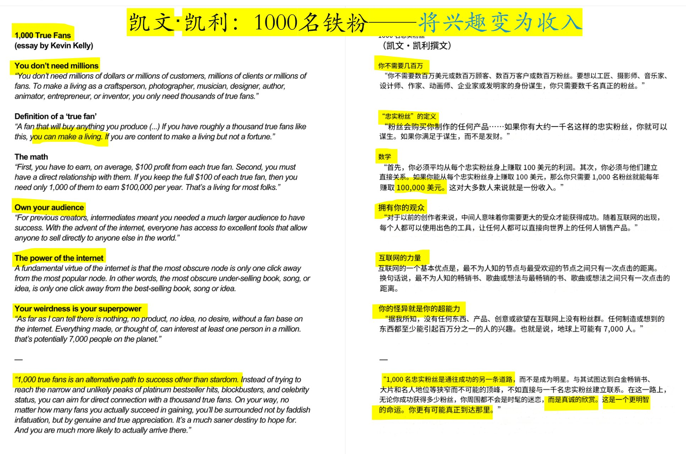
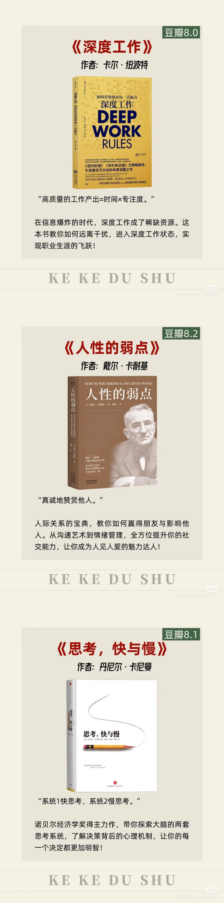
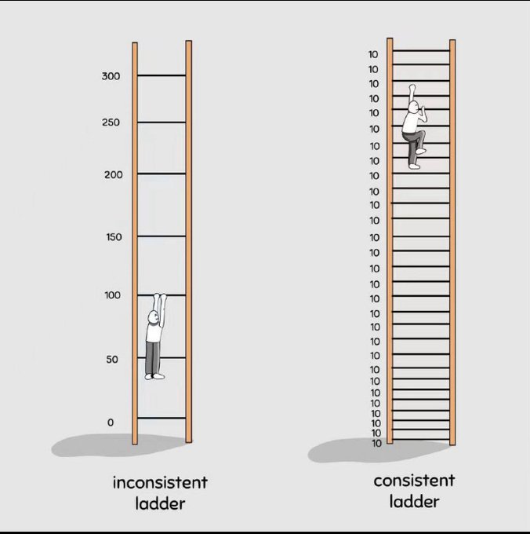

## 英伟达发布会

- [GTC 2025 Keynote](https://www.nvidia.cn/on-demand/session/gtc25-s72484/?playlistId=playList-5d17c33f-65f5-4fb1-9fed-bc5b7f4dec44)
- [NVIDIA CEO 黄仁勋 CES 2025 主题演讲](https://www.nvidia.cn/on-demand/session/ces25-keynote/?playlistId=playList-5d17c33f-65f5-4fb1-9fed-bc5b7f4dec44)

## 好文

- [现在社会普通人的出路在哪里？](https://blog.youya.org/2023/12/26/where-is-the-way/)

我认为首先，这届年轻人要做的第一件事，就是不要去相信上一代享受了时代红利和收益的人给出的各种人生经验，比如说努力奋斗，好好上班可以致富，未来有无限可能等等，因为你们面临的大环境是截然不同的。

这届年轻人要充分想明白，你们面临的大环境下，劳动力就是贬值的。

表现在和过去的年轻人相比，同等条件下却找不到同等条件的工作，只能接受待遇更低的工作，或者是工作环境、时间精力要求更高的工作。

大部分年轻人如今找到的工作，他们所承担的环节，基本都是纯消耗型的内容，消耗了年轻人的时间和精力，却没有任何自我技能方面或者职场竞争力上的提升。

所以，即使五到十年后，会有新一波经济繁荣期到来，这批年轻人大多数已经三十岁甚至往上，不再年轻，但他们的职场竞争力可能同新的应届毕业生没有太大差别。

甚至如果有新型产业崛起，新的工作机会也不会落到这批在这个新兴领域毫无积累的年轻人头上。

除此之外，还有两个建议，是这届年轻人可以仔细考虑并付诸实践的：

**第一个建议是认清现实，积极苟住。**

认清现实说的是不要幻想自己会平稳的上升，不断升职加薪，走上人生巅峰，打工就是打工，不需要有那种「公司是我家」的责任感和荣誉感，你和资本家就是单纯的买卖关系，不要相信「好日子还在后头呢」的画大饼，认真工作，但不要过度工作，锻炼身体，保持一个健康的身心。

积极苟住，说的是在现行的环境下，如果两年还没考上公或者研，家境一般的就不要再继续挣扎了，赶紧先找一份工作，不要过度消费，做好理财规划，手握存款，存款就是你抵御风险的本钱。

**第二个建议，如果不甘心一辈子就这样了，就要在稳住的同时还要浪一把。**

这个浪，其实是在看不清下一个时代方向时的一种「低成本试错」。

我刚刚已经说了，这代年轻人，靠上班基本没有什么前途。

要想把握住下一个时代的方向，只能是在有稳定的大盘下，进行积极的试错。

我推荐几个思路，可以结合起来完成。

一个是多读书，读历史读政治读经济读金融，不要看碎片化的公众号文章，去啃大部头，去培养系统性的思维，培养自己那种能在迷雾中看透真相的能力。

要能清晰的认知这个世界韭菜是如何被收割的，以及如何做能够避免被收割。读完后还要实践和思考，这个的目的是为了让你对时代的脉博和机会有更加敏锐的感知。

第二个是在一的基础上，你结合自己判断的未来有可能有机会的方向，或者是你认知自己有天赋和才能的方向，去做一些副业。

注意我说的是副业而不是兼职，副业是事业，事业是随着你时间精力的投入，能够为你带来复利效应的。

因此，最好的副业就是你能自己掌握生产资料。

我随便举几个例子：

比如说如果你笔头比较好，你就好好写文章，认真经营自己的公众号啊知乎什么的，这个就叫副业。但如果你是给其他公众号投稿，或者是给工作室当枪手，这就不叫副业，这叫兼职，因为这个事情除了赚些外快，并没有给你积累粉丝等重要的资源。

可以多做几个副业，多方向试错。

但我不建议尝试成本太高的副业，大环境不好的情况下副业也会很卷，成功率也很低，大多数普通人都没有承受高成本创业失败的资本。

最好是从一些投入低的副业入手，就算做不成功，也能掌握一门技能，以后失业了也还能凭借技能混口饭吃。

这个就是底线思维。

以上两个建议，只针对相对来说人际交往能力一般，但学习和思维能力比较强的朋友们。毕竟，这个世界上不同类型的人，有不同方式的生存之道。

普适性地说说，

我觉得首先是要踏实下来，摒弃掉一切媒体和文学作品带给你的价值观，从生活出发，好好审视下自己，然后再去思考生活的真相，寻找适合自己的发展道路，真的，这是最重要的一点。

所有你能接触到的信息，都是在以某种隐藏版的方式给你讲故事。

这些故事有意无意地隐藏了那些真实事件中的关键点，只讲述最有利于传播的奇闻异事，对这些故事和道理无条件的全盘接受，带来的只有错误的认知。

那什么叫做从生活出发呢？

我们换一个视角看自己。

假设这是一档历史求生节目，你是一个历史人物，生活在二十一世纪这个历史时期，往后看五十年，什么对你来说是最重要的呢？

我想所有回答你具体细节的人都是骗子，无论他们谈论的是什么终生学习还是人工智能。

真正的道理很简单，任何时代，没有人能预知未来，我们只能活在当下。

站在当下，我们只能尽量保证自己是处在正向循环中，明天一定要比今天好。

一个人掉在大海里，需要做的第一件事，是让自己能够呼吸。

不管用什么姿势，能浮在海面上，保持正常的呼吸，这一定是当下最重要的事。

这时候看什么孙杨的游泳视频，没用，远水解不了近渴。

所以我说，先要认清自己，了解自己的各项情况，包括所处的环境。

你意识不到你在海里，你还去学别人跑步，你马上就被淹死。

认清了所处的环境，下一步干嘛呢？

套路是固定的，你需要了解你生存下去的必要条件，并且列出优先级。

我很喜欢看一个野外生存节目叫《单挑荒野》，探险者艾德孤身深入荒野，不带任何现代求生工具，只能靠自己活下来。

他每集一开始都会念叨一句话：接下来我需要解决最重要的东西——水源、居住地、食物和火。

为什么要念叨，是因为这需要变成一种习惯，即使你意识模糊的时候也能想到，让你有自救的能力。

那么，对于在现代文明中生活的我们而言，什么是生存要素呢？

我的观点——金钱、业余时间、技能和冒险精神。

这四点对比起野外生存而言显得更抽象一些，但这正是文明发展的象征。

我逐一解释下。

金钱：支撑生存和发展的必要资源，必须有经济来源。

业余时间：必须有一定的个人空间和时间来进行思考和规划，用来感知和应付变化，形成正向循环。

技能：用来进行交换和出卖的实用技能，保持精进和拓展，让自己的经济状况更好。

冒险精神：用来突破舒适区，探索未知领域，扩大认知、更新自己的思维体系。

为什么这四项是生存要素？

因为他们可以帮助你正向滚动下去，形成正反馈。

你可以好好检视下自己这几项有否缺失，然后针对性的去完善。

例如说，你特别缺钱，那你应该先什么都不想，给自己挣到能踏实生活半年的物质基础。

或者，你缺过硬的技能，那就选择自己擅长的领域，认真开始修炼一门。

同样，工作时间太满，自己完全腾不出时间跟精力来思考自己未来发展方向的工作，工资高也不要选，因为你迟早被透支，还会失去应付变化的能力。

当然，如果工资特别高除外，短期迅速积累经济也很重要。

这些在你进入一个新环境之前就最好想清楚。

认识清楚环境也同样非常重要，因为这可以防止你定出不切实际的目标。

艾德在节目里经常反省自己的决策，反省的最多的就是自己的盲目扩张和过高目标。

比如老想着去抓一头大动物而忘记找点小食物，想搭一个大屋子结果发现材料不够。

或者只过度关注一种资源而忽视其他。

例如特别着急生火而忘记去寻找食物（做陷阱等）。

订错目标换来的就是饿肚子、受冷以及其他更危险的后果。

现代生存也是如此，好高骛远，被蛊惑被鸡血都不是好事，你要意识到生存是件不容易的事，这并不是轻轻松松万事俱备的游戏世界。

你必须尊重这个世界，尊重的意思即是，了解他的客观性，知道他并不特别针对谁，他有自己的运行逻辑，而如果你随随便便应付生活，生活也会应付你，所以只能认真地去面对每一个出现的问题。

艾德每次的生存结果都随着环境的变化而不同，有的地方饿得快挂掉，有的地方却还能给自己做一顿烛光晚餐。

跟环境有关，有时候跟运气也有关。

所以其实也得意识得到人力是有限的，并不是按着某个道理去做就一定能有如何的结果。

尽人事听天命，我想这也是健康生存的必要认知吧。

夜深了，就简单说到这把。。。

---

更新一下几个问题。

1、问得最多的便是: 读哪些书?

对于一个毫无背景的普通人来说，想成事基本必备的核心文化结构无非都是由以下几本书构成:

《毛选》、《商君书》、《贞观政要》、《盐铁论》、《货币就业与利息通论》、《家庭私有制和国家的起源》、《资治通鉴》、《群书治要》、《君主论》等。

原因很简单: 政治能回答你所有关于发展、晋升、利益、逻辑方面的问题，经济能回答你所有关于赚钱、创业、投资、生意方面的问题。历史能回答你所有关于人性、权谋方面的问题。

读懂了这些，才算是真正意义上的脱离了”文盲群体”。才能大致的明白自己应该在社会上怎么进行自我定位和指定奋斗路径。

也就是看山是山，看山不是山，看山还是山的一个过程。

2、已经成年，错过了读书、婚姻，怎么办? 那就躺平吧，这就是命。

当然，就像前面说的，即使躺平，也要保持身体健康不拉胯，同时也要保持精神愉悦。

人类的竞争本质上还是基因层面的竞争，包括娘胎里带来的外貌和智力水平。可最本质的东西往往是最缺乏的，它决定了你的父母辈在什么阶层，以及你在什么阶层。对于这类人，如果父母辈勤俭节约，不花大钱，不生大病，自己和父母辈一样，不花大钱，不生大病，大概率是能够保持阶层不下滑。

不要相信一夜暴富，逐渐积累财富慢慢理财也可达到小富即安。

对于想要上升阶层，这当然需要足够的运气遇到小概率事件。当然，婚姻也并不是一个特别好的跳板，因为现在的男女都不傻，他们的父母也都不傻，都不想找比自己差的家庭或者个人。另外一个即使实现了上迁的婚姻，也会有各种变数，比如小三小四虎视眈眈被离婚，还得把富二代老公当老板同候，物质看似富裕，但精神不一定轻松。

有人提到这期间创业也是一条途径，但是创业九死一生。

创业需要商业实操能力；需要非常好的商业感知以及领悟力和认知力；需要心狠手快；需要家中有直系亲属或者旁系亲属带路；需要非常高的情商客户政务关系维持能力和管理能力(驾驭人和拿捏人性的能力）……如果你说都具备这些能力，那么可能还需要一定的运气。

商业瞬息万变，小买卖可以做，大生意容易翻船返贫。(比如疫情创业者死一片，相信大家都深有体会)。所以对于普通人而言，创业可以作为一门营生(支个摊儿诚信经营可以)，但是改变阶层或许会有一点点难度(要做大做强很难)。

3、职场新人该如何选公司?

答案是选择成长型公司。

第一、业务方向是自己喜欢并且对口的，因为要陪着一家公司成长起来，很可能要服务多年，与兴趣不符的事情是没有办法持之以恒的，

第二、看这家公司的业务是否满足未来趋势以及产品用户是否众多，这个决定了市场规模能够做到多大，能否满足需求，产品和技术有没有技术壁垒(护城河)。

第三、看公司初创团队的背景和投资方。选好之后沉下心来，踏实工作，公司成熟产品成熟的时候，便是收获的时候。

4、最后

摆正自己的位置，认识真正的自己。绝大部分人从小到大，甚至住进那个四四方方的小盒子里头，都很难认识到一个真相——就是对自己不了解。

你不知道你自己的缺点在哪？优点在哪？不知道你的性格是什么？不知道你的天赋在哪？不知道如何在社会上找到你的定位？

只有真正认识到了你自己，找到自己的定位，规避自己的缺点，扬长自己的优点，才能让你保持正向发展。另外不要想着去改变缺点，这些东西，既然生下来就带有，那就不必强行改变，适当规避就行。

所以老子在《道德经》里头说:”知人者智，自知者明”。故而自剖越深，活的越真。当然，不同阶层的人，形象也是有划分的，一个人的在外穿着打扮，是别人了解你的第一手只资料，形象要走自己能力面前。在真正有成就之后，穿布鞋都没关系，但在转换阶层时，该有的衣冠还是要有。所谓言正压君子，衣冠压小人，先敬罗衣后敬人，先敬皮囊后敬魂。

记住：财富是对认知的补偿，而非是对勤奋的嘉奖，

绝大多数普通人，通常在三十五至四十岁这个阶段，才会明白社会运行的真相和逻辑，但这时的人们正好被钉在生活的十字架上，无力挣扎。而上层阶级出身的人，早在二十几岁时就已经通透，而且还不用考虑过多的试错成本，那是一种传承，用几代人的智慧浇灌出来的。

人生最大的浪费不是金钱的浪费，而是时间的浪费，认知的迟到。

年青时，辗转半宿，刚摸到枕头，天却亮了，带着一点可怜的家底，忧心忡忡的往前冲，这像“赌博”一样，随之而来的，大概率是满盘皆输。垂暮时，回头再看，轻舟已过万重山。

因此，在人生的早期，不管通过什么手段，都要去搞明白社会的真相，社会的运行轨迹。

此文出处【烟雨江湖见闻录】，侵权请联系站长删除。

## 书籍

- 悬崖
- 写好故事的科学原理
- 影响力

- 国家的视角：那些试图改善人类状况的项目是如何失败的
- 失败的逻辑：事情因何出错，世间有无妙策
- 与社会学同游
- 格鲁夫给经理人的第一课
- 《战后欧洲史》
- 《责任的重负》
- 《沉疴遍地》
- 《未竟的往昔》
- 《论欧洲》
- 这才是营销
- 巨婴国
- 美国十讲
- 深度休息
- 如果没有今天，明天会不会有昨天？
- 中间人经济
- Generative AI with Python and PyTorch
- 心流
- 黄金、美元与权力
- The World After Capital
- 《未来呼啸而来》
- 诡辩与真相
- 欧洲五十年-破碎大陆的返航

- 引爆点
- 弱传播
- 经济为什么会崩溃
- 操作系统导论
- Redis 开发与运维

## 工具

- [看电视](https://tv.garden/)
- 能直播录制工具：https://github.com/ihmily/StreamCap
- google notebook: https://notebooklm.google/
- 一键生成临时邮箱：https://github.com/webmonch/hide-my-mail-cloudflare
- 技术：https://animejs.com/
- KrillinAI-一款 AI 视频翻译配音工具：https://github.com/krillinai/KrillinAI
- 无需修改任何代码即可将 MySQL 迁移到 PostgreSQL: https://www.openhalo.org/
- AnimeGamer: Infinite Anime Life Simulation with Next Game State Prediction：https://github.com/TencentARC/AnimeGamer
- 发票生成器：https://github.com/al1abb/invoify
- https://tailwindflex.com/
- 文件传输工具：https://github.com/kyantech/Palmr
- 查询域名信息的工具：https://w.is
- https://deeppdf.ai
- https://github.com/DataoceanAI/Dolphin
- [DockerComposeMaker](https://github.com/ajnart/dcm)
  - https://compose.ajnart.dev/
- MCP server for interfacing with Godot game engine：https://github.com/Coding-Solo/godot-mcp
- 一个强大的 PDF 科学论文翻译工具：https://github.com/funstory-ai/BabelDOC
- 中文的 TTS:
  - https://github.com/fishaudio/fish-speech
  - https://github.com/FunAudioLLM/CosyVoice
  - https://kokorottsai.com/
  - https://elevenlabs.io/
  - https://cartesia.ai/sonic
  - https://azure.microsoft.com/en-us/products/ai-services/ai-speech
  - https://www.minimax.io/
- 监控：
  - https://github.com/bluewave-labs/checkmate
  - https://nezha.wiki/
  - https://github.com/louislam/uptime-kuma
  - https://github.com/harsxv/tinystatus
  - https://github.com/msgbyte/tianji
    - https://template.bja.sealos.run/
    - https://sealos.run/
  - https://github.com/forrany/Awesome-Ollama-Server
- 临时邮箱：https://github.com/beilunyang/moemail
- 【设计】[awesome design dev](https://github.com/noobnooc/awesome-design-dev)
- https://github.com/funnyzak/cli-cheatsheets
- OpenAI Academy
- https://github.com/von-development/awesome-LangGraph
- https://github.com/sentient-agi/OpenDeepSearch
- https://github.com/joeseesun/cards-go
- 滚动截屏工具：
  - https://www.faststonecapture.cn/
  - 浏览器插件：GoFullPage
- 实时协作笔记工具：https://github.com/hedgedoc/hedgedoc
- 硬件相关项目：https://github.com/Rukenshia/pomodoro
- 将一句话转化为惊艳视觉图：https://www.textimagecraft.com/zh
- https://github.com/HeyPuter/puter
- https://github.com/wojciech-kulik/FlashSpace
- 电子书音频化：https://github.com/santinic/audiblez
- 开源手写工具：https://github.com/saber-notes/saber
- https://github.com/ItusiAI/Open-VoiceCanvas
- https://github.com/th-ch/youtube-music
- 项目管理：https://github.com/usekaneo/kaneo
- 配色：https://github.com/catppuccin/jupyterlab
- 数据存储：https://github.com/DioCrafts/OxiCloud
- 东西维修：https://www.ifixit.com/

## Paper

- Inference-Time Scaling for Generalist Reward Modeling: https://arxiv.org/pdf/2504.02495

## 好站

- 盖茨笔记：https://www.gatesnotes.com/

## 课程

- [How to do Everything in the Terminal](https://www.youtube.com/watch?v=u2h5fpNIRhI)
- [Reverse Engineering & Vulnerability Analysis](https://pwn.umasscybersec.org/lectures/index.html#)
- [测试分布式系统](https://asatarin.github.io/testing-distributed-systems/)
- 操作系统：https://mohitmishra786.github.io/exploring-os/src/
  - https://mohitmishra786.github.io/exploring-os/extras/

## 英语学习

- 下课后
- 星蝶公主
- 外星也难民
- 脆莓公园
- Words 图解词根词源 10000 单词速记上
- https://www.voachinese.com/

## 名人名言

- 干中学，要边干边学，别先去学。这是一条被低估的人生建议。
- 不要在兴奋的时候做决定
- 重新认识（吾日三省吾身）

## 好玩

### 新人如何做播客 - 史上最简单(简陋)的教程

- 录音设备: iPhone
- mic
- 录音软件: 语音备忘录
- 剪辑：小宇宙 Studio(Web 版)
- 背景音乐：Pixabay 免费版权音乐
- https://pixabay.com/music/

### 播客网站

- https://xiaohuolufm.com/
- https://www.xiaoyuzhoufm.com/
- https://podcasts.apple.com/cn/browse
- https://music.amazon.com/podcasts
- spotify podcast

### 中文播客榜

- https://xyzrank.com/#/

### 好剧

- 棋士
