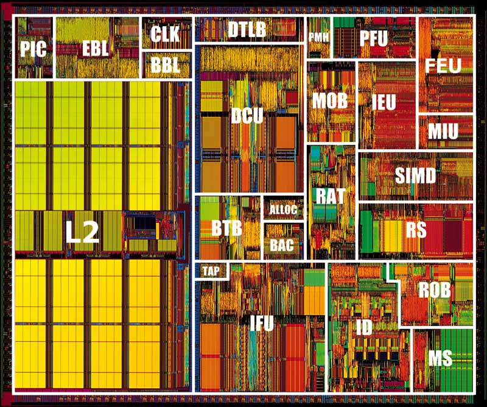
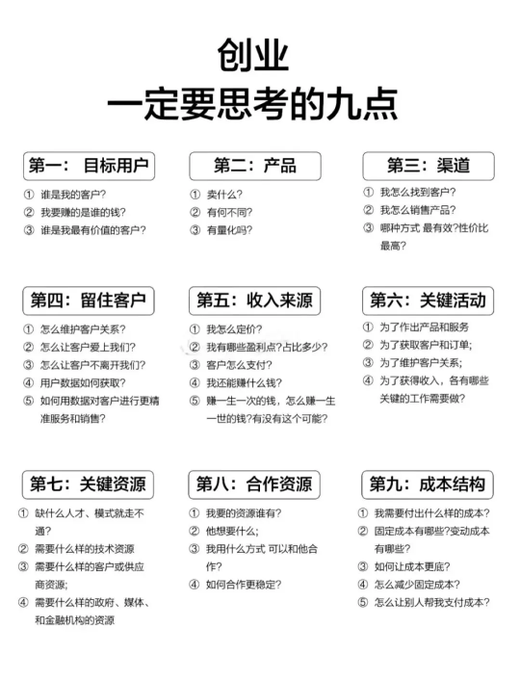
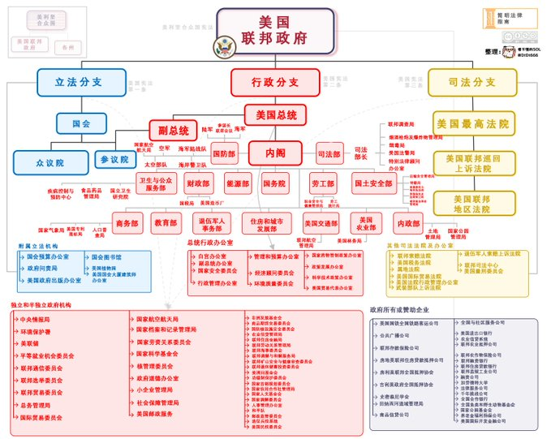
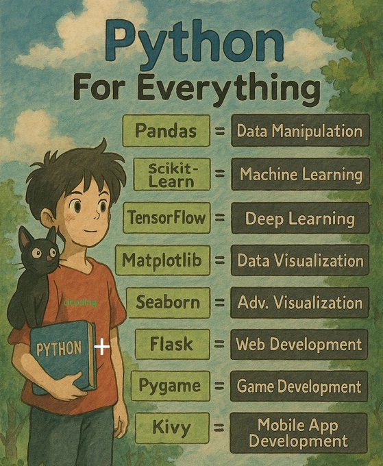
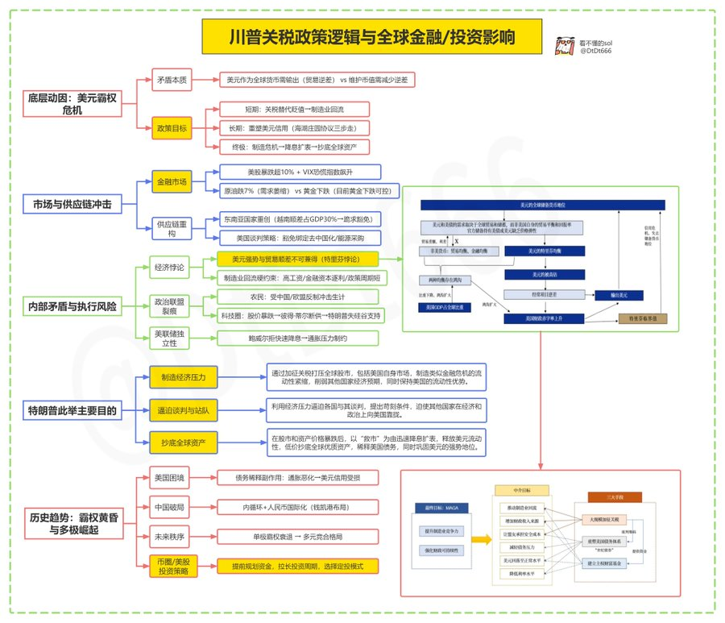

# New way to cloud

> [New way to cloud](https://www.youtube.com/watch?v=Md4Fs-Zc3tg)

## 敏捷开发

- [敏捷宣言](https://www.atlassian.com/zh/agile/manifesto)
- [用户故事](https://www.atlassian.com/zh/agile/project-management/user-stories)
- [看板](https://www.atlassian.com/zh/agile/kanban)

## 读书

- 深度思考
- 《福格行为模型》提出：行为=动机+能力+提示。

> 动机：即时娱乐触发多巴胺分泌，形成短暂愉悦感，持续强化行为。
>
> 能力：“零门槛”滑动手指即可切换内容
>
> 提示：手机不离身+抖音频繁推送

- 强风吹拂
- 复利人生
- 债务危机，我的应对原则
- 未来简史
- 苏世民·我的经验与教训
- 世界秩序
- 更富有、更睿智、更快乐

## 视频教程

- [C web server from scratch](https://www.youtube.com/playlist?list=PLDqjvz44o_1Uj90bCt5K81NSlJhLUYG9e)

## 英语学习

- [the english pod](https://www.youtube.com/@TheEnglishPod)
- [Learning English Podcast](https://www.youtube.com/@LEP-LearnEnglishPodcast)

## 工具

- https://github.com/jiangrui1994/CloudSaver：一个基于 Vue 3 + Express 的网盘资源搜索与转存工具。
- https://github.com/BeyondXinXin/nixvis：Nginx 日志分析工具
- https://github.com/mycoco/DNS-Splitter：DNS 分流器
- https://www.jisuxiang.com：在线开发工具
- https://github.com/Zackriya-Solutions/meeting-minutes：会议记录
- https://github.com/vllm-project/vllm：A high-throughput and memory-efficient inference and serving engine for LLMs
  - https://ar5iv.labs.arxiv.org/html/2309.06180
- https://github.com/Nutlope/self.so：简历工具
- https://huggingface.co/spaces/enzostvs/deepsite：deepsite，网站制作工具
- https://github.com/xming521/WeClone：使用微信聊天记录微调大语言模型，使用微信语音消息大模➕0.5B大模型实现高质量声音克隆，并绑定到微信机器人，实现自己的数字分身。 数字克隆/数字分身/数字永生/声音克隆/LLM/大语言模型/微信聊天机器人/LoRA
- https://github.com/wangjueszu/gpt-4o-py：工具
- https://github.com/kvcache-ai/ktransformers/blob/main/doc/en/llama4.md
- https://mermaid.js.org/intro：mermaid 工具
- https://flux.devooo.top：Flux AI 绘画馆
- https://promptup.net：提示词管理
- https://github.com/danbev/learning-ai
- https://github.com/beilunyang/moepush
  - https://moepush.app/：消息推送
- https://dang.ai/ai-graveyard：ai失败产品清单
- 一款本地化 AI 视频翻译和配音的开源工具：KrillinAI：https://github.com/krillinai/KrillinAI
- GitHub 上发现一款可视化大模型内部运作的开源工具：OpenMAV
- https://github.com/kubernetes-sigs/headlamp
  - https://headlamp.dev/

## 好玩

- 曼陀罗风铃
- CPU







- 游戏：https://www.juzixiazai.com/

## 新闻

- https://firebase.studio/
- https://github.com/redis/redis/releases/tag/8.0-rc1

```
AI 编程赛道的最大玩家入场
Google 推出 Firebase Studio，融合了 Cursor+lovable+replit+v0+boltnew，从 AI 编程到云服务的生产级部署，包括 API、后端、前端、移动应用等。
```

- [Announcing the Agent2Agent Protocol (A2A)](https://developers.googleblog.com/en/a2a-a-new-era-of-agent-interoperability/)

## 博客

- https://enhancedformysql.github.io/tech-explorer-hub/reading/database/postgresql.html
- https://agents.cloudflare.com/

## 文章

```
来自深度！其实川普没疯，他在下一盘大棋（万字长文，可跳过，结论放文尾部总结）
这几天全球性暴跌/美国的关税政策炸锅了，
尤其是币圈/股票圈,纷纷评价懂王是不仅蠢而且坏，现在竟然还疯了。
川普的关税大棒，股市第一个被打趴下，
美股两天大跌10%，市值蒸发5万亿美元，
原油暴跌7%，连黄金都大跌了2%，币圈更不用言语。
只有一个指数是大涨的，这就是恐慌指数vix，创下了2020年2月以来的最高数值，可见资金的不安程度。
现在全网都在骂，川普政府大搞孤立主义，
很可能让世界经济开倒车，全球的搅屎棍！
关键是，他这样做，不仅害人，而且害己。
接下来，美国的通胀和经济的倒退几乎无法避免，
这样的总统怎一个”疯子”了得。
当我看到几个我觉得还是挺有水平的财经博主，文章也是虚火直冒，就差没骂川普是超级大S.B了。
我想，我该写点文章说点什么了。

和几乎所有人的观点不同，
我可以确定：懂王没疯，他在下一盘大棋；
但我不确定的是：这盘棋，他能不能赢？

本文即将为大家揭开一个真相，就是川普咋咋呼呼，牛逼轰轰的的背后，确实是美国出现了一些深层次问题，确实事关美国未来还能否继续“伟大”的问题。

但是和很多投资玩家以为的不同，不是美国经济衰退，通胀，产业空心化，赤字，债务危机等等，只在乎自己币，自己的票为什么跌这么惨！

事实上美国经济现在很不错，
国内炒美股的朋友平时要分析大量的美国基本面，自然很清楚。
不过债务高企确实是个大的困扰，但还远没有到危机的时候，其实全世界很多大国的债务麻烦都是半斤八两，有的国家就不想说了。
但如果美国不去解决这个隐忧，长期必然导致衰退，甚至引发国际贸易和金融体系的巨大问题。
那到底是什么呢，我甚至觉得是经济学理论发展的最前沿问题。

🟨1、先从一个底层经济知识讲起：
有一天，地球终于迎来了传说中的世纪大洪水，最后剩下的就只有两个岛屿，形成了两个国家，一个是A国，一个是C国。
但由于C国全域是肥沃的土壤，而A国土壤不如C国，所以生产农作物以及派生的肉蛋奶等食品，成为C国的比较优势；
而A国人从小善于学习和创造，所以A国人发明和生产高科技产品的能力强于C国，所以生产高科技产品成为A国的比较优势。
当然，除了食品和高科技产品各有优势外，其他商品，比如服装，房子，生活用品等等还是各自生产各自的，不发生贸易。
为了人类生存，所以两国达成永久协定，两国的贸易商必须自由化市场化，不得有关税壁垒和歧视。
因为两国都有各自的货币，于是，因为持续国际贸易的原因，也就形成了某个汇率。
假设有一天，C国因为掌握了某种技术，也即是生产力进步，使得农产品的产量大涨，副食品也产量更多；而A国没有技术进步，产量和品质没有长进。这时候会发生什么现象呢？
这时候，C国销往A国的食品可能会增加，这时候，会出现一个经济现象，就是汇率会自我市场调节，使得两国的贸易重新平衡。
我们知道，两国贸易商销往对方的商品，换回来的钱必须是本国货币，所以不论怎么交易，最终两国的流入和流出货币必须相等，也就是经常账户余额为零，没有顺差也没有逆差。
所以，如果还是按照原有价格进行贸易，A国因为进口的货物增加，就会造成经常项目的逆差，市场因此会自动平衡这种逆差，食品和高科技产品的价格和销售数量都可能会变化。
最终，A国的货币相对于C国，汇率会发生贬值，如果不贬值，贸易将无法平衡。
当一国持续逆差，货币流出大于流入，汇率会自动贬值，使得商品进口变得昂贵，而出口变得有竞争力，随着商品出口增多，进口减少，商品会自动形成贸易平衡。

🟨2、回到现实，美国自从布雷顿森林体系解体以后，美国的贸易逆差就开始出现。

现在讲一个本最重要的逻辑主线：
既然美国经常账户长期巨额逆差，那如上文的案例，如果美元汇率贬值，不就万事大吉了么。
那样对美国而言，其他国家的商品就贵了，本国老百姓就不会那么毫无节制地买买买了；而自己国家生产的商品就便宜了，国际上自然就有竞争力了，贸易也就会平衡，川普就没有理由叫嚣全世界占了美国便宜，就不会发生今天川普大搞关税大战。
🚩那么问题来了，为什么外汇市场出现失灵，美元没有贬值呢？
为了讲清楚这个话题，我先从汇率的形成讲起。
汇率是货币之间的价格，它在商品贸易和资本国际流动的时候成为交易的价格，商品贸易形成一国之经常账户，资本进出形成一国之资本账户，这两个账户收支共同作用，形成汇率。
美国尽管长期经常项目巨额逆差，美元长期流出；但由于资本账户是巨额顺差，美元长期流入。两个账户相互抵消，在外汇市场上就形成了比较稳定的汇率。
所以，外汇市场并没有失灵，美国的汇率确实是国际外汇市场公开透明交易出来的。

🚩那接下来的问题是，为什么资本账户（金融账户）美元长期流入呢？
这种情况在非美货币不会发生，而在美元身上就会发生，是美元特有的，原因就是美元是世界货币。
因为美元是世界货币，就自然具备了国际清算和储备的功能。
国际上各个其他非美国家，在出口过程中，就会要求美元结算，并且将挣到的美元储备起来，一来为了进口的时候有美元支付，二来也是保持自身金融市场的稳定性。
尤其中国，美元还成为央行的底层资产，成为发行人民币的国际信用。
但这些超额的美元，并不会躺在央行的储备账户上，而是通过购买美元债而回流回美国，所以美国的资本账户上美元又是长期净流入的。
这么一番解释，相信大家就把平时知道的信息连在一起了，但这还没完，最重要的知识点来了。
这就是美国特有的特里芬难题。

🟨3、有一定经济和金融功底的人都知道特里芬难题，《黄金与美元的危机：自由兑换的未来》一书的作者特里芬提出，为了保持美元全球货币的地位，美国需要源源不断向外输出美元。

非美国家为了发展国际贸易和保持金融市场的稳定性，往往会积累一定体量的美元形成外汇储备。因此，美元除了贸易需求以外，还形成了一部分缺乏弹性的储备需求，这导致了美元币值天然被高估。

美元被高估则意味着，进口相较于国内生产更具性价比，因此制造业部门成为“强势”美元的牺牲品。然而，一个国家的货币之所以被认可为全球货币，是因为其强大的国际竞争力,即科技、制造、军事等硬实力，然而，随着美国贸易逆差的持续扩大、制造业的持续流出，最终会导致非美国家的重新思考--美国的竞争力足以匹配它的货币地位吗?

考虑到一些读者的接受度，我把上文用大白话翻译一下：

1、美元为什么会被高估？
举一个例子，当年我们在发展股市的时候，早期那些老同志毕竟都是刚刚开始学习经济学，所以给上市公司国有股份加以限制，要求不得市场流通，原因当然是害怕国有资产流失的问题。

一家公司的效益是全体股本产生的，但真正流通的只是一部分，另一部分就成为死股本，也即是市场认为是不存在的资本，所以市场就会发生扭曲，认为公司效益就是那一部分流通的股本产生的，所以流通股的股价就会不合理无形拉高，也就是这家公司的市值就会被不合理高估。

由此，就产生了本世纪初的几年A股的大熊市，因为股民和管理层在闹，管理层想要国有股解禁，而股民不答应，最后由于还算不错的补偿方案推出，加上中国经济在WTO的高速增长，A股在随后的几年进入它的高光时刻。。。
同理，美元的一部分成为各国央行的储备不参与市场流通和买卖，那也会在无形中让美元的汇率高估---简单说，今天的美元，也包括过去的美元，是不值这个价的。

那么，你现在还会积极换汇吗？

2、美元高估后的影响
我们普遍认为，中国因为劳动力优势和生产力发展，而美国由于科技发达，国民富裕，所以造成美国只有靠高科技和金融业产生财富，工资高导致制造业没有竞争力而空心化，所以，美国在普通商品的竞争中，和中国相比败下阵来。

这么理解不能说是错的，但并不是全部。

假设美元不是世界货币，就不存在资本账户的长期超额顺差，那么美元汇率一定会大幅贬值。

这样，进口货物就会涨价，美国人购买以中国商品为代表的数量上肯定就会下降；而美国制造业的商品出口，至少在相当部分就有了竞争力，而不会如今天在全方位上都没有竞争力，最终美国达成贸易平衡。

尤其在今天的美国，大量机器人的应用，其实很多不关心现代制造业变化的读者恐怕不知道，现代制造业由于科技的应用，和劳动力成本的关系已经不是那么大了。

我个人觉得，假设美国汇率贬值，那些可以在生产线上批量生产，比如汽车，机电产品，甚至部分家电，钢铝，美国自己生产后内销，甚至部分出口都完全有了可能。

不好意思，我还要讲美国的对手盘中国，一个残酷的现实是，我们以为的商品上的价格竞争力，可能大部分不过是长期媒体宣传给你的幻觉。

我们知道，我们是有严格的外汇管制的，我们的汇率政策也不是市场化定价的---换句话说，我们的汇率存在严重的低估。

因为我们一直长期有大量的经常账户和资本账户的双顺差。

现在被低估多少，我还有点难以说清了。但如果在十年前，我们和美元的合理汇率是1:4左右。

假设，我说假设，如果现在汇率是1:4，你还会觉得我们的产品有多少竞争力呢。

假设中美两国汇率一升一降，我觉得川普根本没兴趣给我们加关税了。

3、近期黄金为什么持续上涨

美国如果不寻求改变，如果还是如拜登那样稳如老狗，短期再搞几个总统更替也其实没任何问题，但长期看，美国的国际地位将下降，由于贸易和财政双逆差，美元以美债构筑的强大信用将会逐步滑坡。

美元的底层是美债，美债的底层是美国经济在全球的霸主地位，如果国际经济地位下滑，美元作为世界货币的支撑力也将下滑。

这就解释了黄金在这几年为什么突突上涨的一个重要原因。（虽然这两天情绪影响有所小跌）

黄金这两年的涨势已经完全脱离了美元实际利率的叙事逻辑，而跟各大央行主动购金相关，最大的购金大金主就是我们中国的央行。（上述科普内容部分摘取小Lin/知乎）

🟨最后总结一下自己想法吧，做为玩家，不去想太多，你可以简单理解为：关税大棒的核心就是无差别的搜刮，帮助美国解决债务问题，让美国继续称霸，特朗普最希望的：

1、4月加关税；
2、4月5月，主要经济体都来求他，美国为接下来的降息扩表进行利益谈判。
3、6月，谈得差不多了，股市也跌得差不多了，开启大放水，再次收割。

当然，能不能落地还要看美联储，还要看通胀数据，且有一番博弈。
总共分3步：
1、挥舞关税大棒，打爆股市，包括自己家的，这就有点类似人造的金融危机，保持美国流动性的同时，制造全球的流动性紧缩，打击其他国家的经济预期；
2、逼迫各国跟他谈，提出讹诈式要求，逼迫站队；
3、当股市暴跌，资产价格暴跌，他就能以“救市”为理由，迅速降息扩表。流出来的美元，抄底全球资产。这样美元既能保持强势，还能稀释债务。

所以懂王加关税的最终目的，就是为下半年的降息扩表做准备，先砸出低估的资产价格，美元才能进场，最终要解决美国的债务问题。

我们投资，要做的就是顺势而为！
我能想到最坏的结果就是：川普任期结束，一切都会回来！
```


