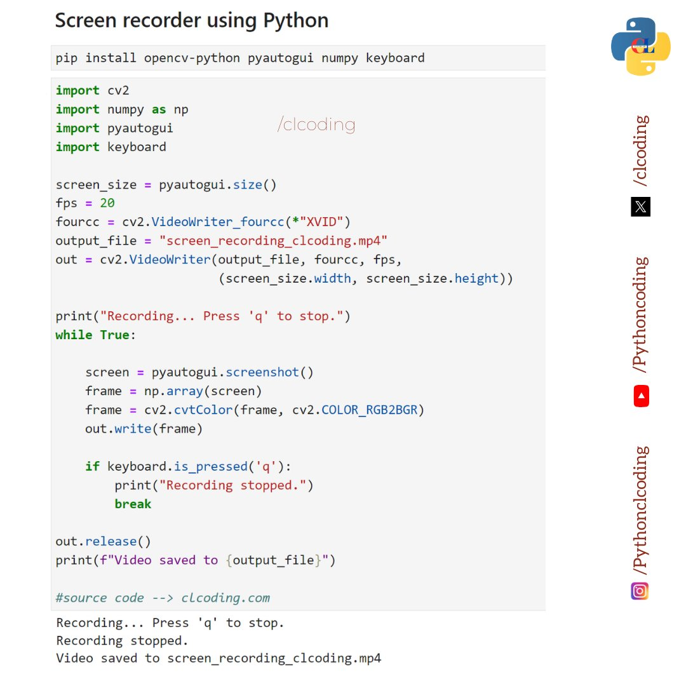
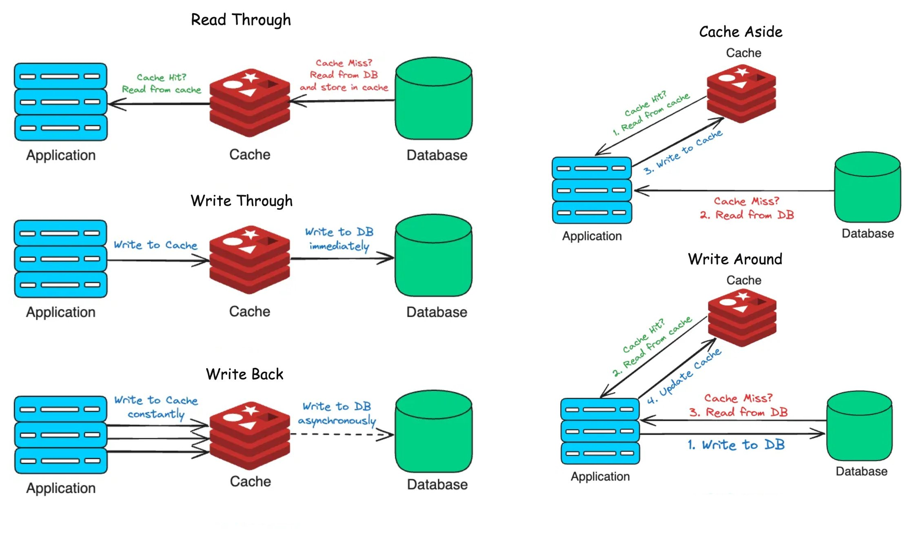

# 好好说话

2025年1月23日，早上坐地铁上班，到地铁客运中心换乘地铁1号线（湘湖-萧山国际机场方向）列车去文海南路去上班。在客运中心换乘的时候发生了一件很不痛快的事情。

换乘的时候，我在等1号线湘湖-萧山国际机上方向的列车，车子到了，我上了车，另外一个阿姨直接坐上一个座位，并且还占了一个座位。我说，“你不能另一个人还没到就开始占座吧”。她大声对我说，“她是孕妇！”听到这里我就直接找其他的座位了。我在别的座位上刚坐下，用眼睛白冷了她一眼。

发生今天这个事情主要的原因是，自己还是不够大度，还是要谦让。况且她还是为比自己年长的阿姨。下次这种情况，自己直接找其他的座位，或者站着，又累不着自己。

让自己不痛快的点在于那个阿姨没有好好说话。她哪管对我平声说，“我女儿怀孕了。”说到这里，我也会立马让座。不会再做到别的座位上还白冷了她一眼。

总而言之，还是自己的观察能力不够，不懂得谦让，实属是需要提升的能力呀！还有就是自己的反应能力还是要增强，脑子还是要更快些才好，话也得赶趟。

### 工具
- 【免费API】[免费的企业级 Deepseek R1 API ](https://build.nvidia.com/explore/discover)
- 【日历】[2023-2025中国节假日、调休、补班日历](https://github.com/lanceliao/china-holiday-calender)
- 【搜素】[meilisearch](https://github.com/meilisearch/meilisearch)
  - https://www.meilisearch.com/
- 【本地发送文件】[localsend](https://github.com/localsend/localsend)
- [magic-wormhole](https://github.com/magic-wormhole/magic-wormhole)
- 【设计】[canva](canva.com)
  - https://canva.cn
- 【系统监控】[监控所有服务的服务uptime kuma](https://github.com/louislam/uptime-kuma)
  - https://uptime.kuma.pet/
- 【工具】[Open source Spotify client](https://github.com/KRTirtho/spotube)
- 【游戏开发工具】[Open-source game development software](https://github.com/4ian/GDevelop)
  - https://gdevelop.io/zh-cn
- 【白板工具】[excalidraw](https://github.com/excalidraw/excalidraw)
- 【应用】[Modern open-source time-tracking app](https://github.com/solidtime-io/solidtime)
- 【开源软件】[很好用的开源安卓软件](https://github.com/xlucn/oh-my-foss-android)
- 【工具】[硅基流动](https://account.siliconflow.cn/login)
- 【软件】[一款开源免费的安卓电视直播软件：mytv-android](https://github.com/sakana164/mytv-android)
- 【软件】[NginxUI](https://github.com/0xJacky/nginx-ui)
  - https://nginxui.com/zh_CN/
- 【软件】[Apache Airflow](https://airflow.apache.org/)
- 【工具】[DeepSeek R1 is now live on Azure AI Foundry and 
@GitHub](https://azure.microsoft.com/en-us/blog/deepseek-r1-is-now-available-on-azure-ai-foundry-and-github/)
- 【AI】[deepseek](https://www.deepseek.com/)
- 【工具】[微信公众号订阅方式，支持私有化部署、微信公众号RSS生成（基于微信读书）v2.x](https://github.com/cooderl/wewe-rss)
- 【工具】[About
A libre lightweight streaming front-end for Android.](https://github.com/TeamNewPipe/NewPipe)
  > 对国内设备非常友好，不需要安装 Google 服务框架也能使用，而且无需登录 YouTube 账号。
- 【工具】AI 工作流平台
  - https://dify.ai/
  - https://www.coze.cn/
  - https://www.langflow.org/
- 【工具】程序员 AI 开发工具
  - https://v0.dev/
  - https://bolt.new/
  - https://www.trickle.so/
  - https://devv.ai/zh
  - https://www.perplexity.ai/
- 【工具】[DualSense 在线测试](https://ds.daidr.me/)
  - https://github.com/daidr/dualsense-tester
- 【工具】[Comfortably monitor your Internet traffic](https://github.com/GyulyVGC/sniffnet)
  - https://sniffnet.net/
- 【工具】[PebbleOS](https://github.com/google/pebble)
- 【工具】[开箱即用的 Markdown 简历](https://github.com/BingyanStudio/LapisCV)
- 【电报】[高质量的电报群](https://github.com/jackhawks/rectg)
- 【大模型】[MNN 大模型 Android App](https://github.com/alibaba/MNN/blob/master/project/android/apps/MnnLlmApp/README_CN.md)
- 【工具】[一款实用的 Homebrew 可视化工具：Applite](https://github.com/milanvarady/Applite)
- 【工具】[Enhanced ChatGPT Clone: Features Agents, DeepSeek, Anthropic, AWS, OpenAI, Assistants API, Azure, Groq, o1, GPT-4o, Mistral, OpenRouter, Vertex AI, Gemini, Artifacts, AI model switching, message search, Code Interpreter, langchain, DALL-E-3, OpenAPI Actions, Functions, Secure Multi-User Auth, Presets, open-source for self-hosting. Active project.](https://github.com/danny-avila/LibreChat)
- 【工具】[We used DeepSeek-V3 to classify every AI paper on arXiv by topic (agents, VLMs, etc)](https://www.alphaxiv.org/explore)
- 【工具】[Bring projects, wikis, and teams together with AI. AppFlowy is the AI collaborative workspace where you achieve more without losing control of your data. The leading open source Notion alternative](https://github.com/AppFlowy-IO/AppFlowy)
- 【工具】[onlook](https://github.com/onlook-dev/onlook)
- 【工具】[About fabric is an open-source framework for augmenting humans using AI. It provides a modular framework for solving specific problems using a crowdsourced set of AI prompts that can be used anywhere.](https://github.com/danielmiessler/fabric)
- 【工具】[一款跨平台视频下载工具：Lux](https://github.com/iawia002/lux)
- 【工具】[新榜](https://www.newrank.cn/)
- 【工具】[deepseek jenus](https://github.com/deepseek-ai/Janus)
- 【工具】[Open Data Structures](https://opendatastructures.org/)
- 【工具】[RAG Web UI](https://github.com/rag-web-ui/rag-web-ui)
- 【资料】[A curated list of references for MLOps](https://github.com/visenger/awesome-mlops)
  - https://ml-ops.org/
- 【资料】[数据工程师 Complete-Machine-Learning-](https://github.com/Coder-World04/Complete-Machine-Learning-)
- 【工具】[免费照片转视频 AI 生成器](https://phototo.video/)
- 【工具】[Visualize and process JSON in seconds](https://json4u.com/)
- 【工具】[可部署到个人服务器上的实用工具集合](https://github.com/awesome-selfhosted/awesome-selfhosted)
- 【工具】[简简单单的看直播](https://github.com/xiaoyaocz/dart_simple_live)
- 【工具】[gitbutler](https://github.com/gitbutlerapp/gitbutler)
- 【工具】[The world's most flexible commerce platform](https://github.com/medusajs/medusa)
- 【工具】[A web scraping and browser automation library for Python to build reliable crawlers](https://github.com/apify/crawlee-python)
- 【工具】[Everything you need to build state-of-the-art foundation models, end-to-end.](https://github.com/oumi-ai/oumi)
- 【工具】[Finetune Llama 3.3, Mistral, Phi-4, Qwen 2.5 & Gemma 2-5x faster with 80% less memory](https://github.com/unslothai/unsloth)
- 【工具】[The Fastest State-of-the-Art Static Embeddings in the World](https://github.com/MinishLab/model2vec)
- 【工具】[Free, simple, and intuitive online database diagram editor and SQL generator-drawdb](https://github.com/drawdb-io/drawdb)
- 【工具】[A self hosted virtual browser that runs in docker and uses WebRTC](https://github.com/m1k1o/neko)
- 【工具】[A list of Free Software network services and web applications which can be hosted on your own servers](https://github.com/awesome-selfhosted/awesome-selfhosted)
- 【网站】[OmniParse](https://github.com/adithya-s-k/omniparse)
  > OmniParse is a platform that ingests and parses any unstructured data into structured, actionable data optimized for GenAI (LLM) applications. Whether you are working with documents, tables, images, videos, audio files, or web pages, OmniParse prepares your data to be clean, structured, and ready for AI applications such as RAG, fine-tuning, and more
- 【工具】[浏览器翻译插件](https://github.com/Bistutu/FluentRead)
- 【工具】[字节跳动开源的一款视频深度估计工具：Video Depth Anything](https://github.com/DepthAnything/Video-Depth-Anything)
- 【工具】[Open source form builder](https://github.com/heyform/heyform)
- 【工具】[利用AI大模型，一键生成高清短视频](https://github.com/harry0703/MoneyPrinterTurbo)
- 【工具】[Jan is an open source alternative to ChatGPT that runs 100% offline on your computer](https://github.com/janhq/jan)
  - https://jan.ai/
- 【工具】[Open source LLM engineering platform](https://github.com/langfuse/langfuse)
  - https://freetts.app/
- 【工具】[Swiss-army tool for scraping and extracting data from online assets, made for hackers](https://github.com/bjesus/pipet)
- 【工具】[Coroot is an open-source APM & Observability tool](https://github.com/coroot/coroot)
- 【工具】[Open Operator](https://open-operator.vercel.app/)
- 【工具】[Fully open reproduction of DeepSeek-R1](https://github.com/huggingface/open-r1)
- 【工具】[elmo.chat](https://www.elmo.chat/)
- 【工具】[icons images](https://icons.expo.app/)
- 【工具】[开源ERP](https://github.com/frappe/erpnext)
- 【工具】[视频生成模型](https://replicate.com/tencent/hunyuan-video)
  - https://replicate.com/minimax/video-01
  - https://replicate.com/minimax/video-01-live
  - https://replicate.com/kwaivgi/kling-v1.6-standard
- 【工具】[简历制作](https://easycv.cn/)
- 【工具】[工具集合](https://www.matools.com/)
- 【工具】[一款功能强大的手机投屏电脑工具：Escrcpy](https://github.com/viarotel-org/escrcpy)
- 【工具】[用最快的速度把你的文件变成一个支付链接](https://etail.me/)
- 【工具】[About Label Studio is a multi-type data labeling and annotation tool with standardized output format](https://github.com/HumanSignal/label-studio)
- 【工具】[讲人话就能让 AI 帮你爬海量数据-Firecrawl](https://www.firecrawl.dev/)
- 【工具】[Youtube 下载器](https://github.com/MattBlackOnly/TubeTube)
- 【工具】[TikTok/抖音无水印在线解析下载](https://douyin.wtf/)
- 【工具】[一款开源免费的封面图片制作工具：PicProse](https://github.com/jaaronkot/picprose)
- 【工具】[Kats, a kit to analyze time series data, a lightweight, easy-to-use, generalizable, and extendable framework to perform time series analysis, from understanding the key statistics and characteristics, detecting change points and anomalies, to forecasting future trends](https://github.com/facebookresearch/Kats)

### 课程 & 书籍📚
- 【系统设计】[system design interview](https://github.com/mukul96/System-Design-AlexXu)
- 【Python学习课程】
  
- 【论文】[Foundations of Large Language Models](https://arxiv.org/abs/2501.09223)
- 【实时视频音频工具】[livekit](https://github.com/livekit/livekit)
- 【课程】[MIT 6.5630 Advanced Topics in Cryptography, Fall 2023](https://www.youtube.com/playlist?list=PLUl4u3cNGP61EZllk7zwgvPbI4kbnKhWz)
  - [Advanced Topics in Cryptography](https://ocw.mit.edu/courses/6-5630-advanced-topics-in-cryptography-fall-2023/)
- 【书籍】[数学与生活系列图书](https://book.douban.com/subject/26148739/)
- 【书籍】[这才是好读的数学史](https://book.douban.com/subject/33430525/)
- 【书籍】[数学史·上下](https://book.douban.com/subject/10732014/)
- 【学习资料】[关于学习数据库资料合集](https://github.com/pingcap/awesome-database-learning)
  - [TiDB](https://github.com/pingcap)
- 【课程】[开源免费的大语言模型课程：LLM Course](https://github.com/mlabonne/llm-course)
  - https://mlabonne.github.io/blog/
  - https://github.com/PacktPublishing/LLM-Engineers-Handbook
- 【课程】[LLM-engineer-handbook](https://github.com/SylphAI-Inc/LLM-engineer-handbook)
- 【课程】[Stanford CS234: Reinforcement Learning](https://www.youtube.com/playlist?list=PLoROMvodv4rOSOPzutgyCTapiGlY2Nd8u)
  - [Stanford CS234 Reinforcement Learning I Introduction to Reinforcement Learning](https://www.youtube.com/playlist?list=PLoROMvodv4rN4wG6Nk6sNpTEbuOSosZdX)
- 【课程】[The C Language](https://www.youtube.com/watch?v=ZwqDd-WM4kk&list=PLTbERlX_4R03PpUhJJ-f1cTC-Y_tLucHZ)
- 【书籍】[Linux Kernel in a Nutshell](https://theswissbay.ch/pdf/Gentoomen%20Library/Operating%20Systems/Linux/O%27Reilly%20Linux%20Kernel%20in%20a%20Nutshell.pdf)
- 【课程】[Harvard University just released a free online courses](https://x.com/LearnWithSubhan/status/1885713125653049428)
- 【书籍】[Mathematics for Machine Learning](https://course.ccs.neu.edu/ds4420sp20/readings/mml-book.pdf)
- 【书籍】[10 "C" Programming Books](https://x.com/swapnakpanda/status/1885678521780981779)
- 【书籍】[群体的智慧](https://book.douban.com/subject/4924898/)
- 【书籍】[如何学习](https://book.douban.com/subject/27081766/)
- 【书籍】[A Malloc Tutorial](https://wiki-prog.infoprepa.epita.fr/images/0/04/Malloc_tutorial.pdf)
- 【课程】[Introduction to Computational Thinking and Data Science](https://ocw.mit.edu/courses/6-0002-introduction-to-computational-thinking-and-data-science-fall-2016/)
  - [课程视频](https://www.youtube.com/playlist?list=PLUl4u3cNGP619EG1wp0kT-7rDE_Az5TNd)
- 【课程】[Linear Algebra](https://ocw.mit.edu/courses/18-06sc-linear-algebra-fall-2011/)
  - [课程视频](https://www.youtube.com/playlist?list=PL221E2BBF13BECF6C)
- 【课程】[DeepMind x UCL | Reinforcement Learning Course 2018](https://www.youtube.com/playlist?list=PLqYmG7hTraZBKeNJ-JE_eyJHZ7XgBoAyb)
- 【视频课程】[How does Linux Runs Executable?](https://x.com/chessMan786/status/1885033894053114030)
- 【书籍】[会走路的钱·上下](https://book.douban.com/subject/34977252/)
- 【书籍】[分布式系统模式](https://martinfowler.com/articles/patterns-of-distributed-systems/)
- 【课程】[OS in 1000 lines](https://operating-system-in-1000-lines.vercel.app/zh/)
- 【书籍】[智人之上(Nexus)](https://book.douban.com/subject/37001305/)
- 【资源】[Some useful websites for programmers.](https://github.com/sdmg15/Best-websites-a-programmer-should-visit)
- 【课程】[Unified Efficient Fine-Tuning of 100+ LLMs & VLMs ](https://github.com/hiyouga/LLaMA-Factory)
- 【书籍】Writing a C Compiler: Build a Real Programming Language from Scratch
- 【课程】[英伟达开源课程](https://sp-events.courses.nvidia.com/dli-india25?ncid=ref-inpa-419622)
- 【阅读清单】[DeepSeek R1 阅读清单](https://github.com/ninehills/blog/issues/121)
- 【课程】[Machine Learning Course](https://www.youtube.com/playlist?list=PLoROMvodv4rMiGQp3WXShtMGgzqpfVfbU)
- 【课程】[Deep Learning](https://www.youtube.com/playlist?list=PLoROMvodv4rOABXSygHTsbvUz4G_YQhOb)
- 【书籍】[Operating Systems: Three Easy Pieces](https://pages.cs.wisc.edu/~remzi/OSTEP/)
- 【学习资料】[生成式 AI 学习指南 awesome-generative-ai-guide](https://github.com/aishwaryanr/awesome-generative-ai-guide)
- 【课程】[Architecture 1001: Intel x86-64 Assembly](https://www.youtube.com/playlist?list=PLUFkSN0XLZ-m9B0DhHjkXd8foIMuZO1Gd)
- 【课程】[MIT 6.006 Introduction to Algorithms, Spring 2020](https://www.youtube.com/playlist?list=PLUl4u3cNGP63EdVPNLG3ToM6LaEUuStEY)
  - [Introduction to Algorithm](https://ocw.mit.edu/courses/6-006-introduction-to-algorithms-spring-2020/pages/lecture-notes/)
- 【视频】[How to design a Simple Memory Allocator for your Operating System](https://x.com/i/status/1883709954403500180)
- 【slide】[Deep C & C++](https://www.pvv.org/~oma/DeepC_slides_oct2011.pdf)
- 【书籍】[Understanding Machine learning](https://www.cs.huji.ac.il/~shais/UnderstandingMachineLearning/understanding-machine-learning-theory-algorithms.pdf)
- 【网站】[learncpp](https://www.learncpp.com/)
- 【书籍】人的潜能和价值
- 【学习网站】[Memory Management](https://isocpp.org/wiki/faq/freestore-mgmt)
- 【api 设计】[Developing Restful APIs](https://github.com/zalando/restful-api-guidelines)
- 【书籍】[Mathematics for Computer Science](https://courses.csail.mit.edu/6.042/spring18/mcs.pdf)
- 【书籍推荐】
  - 《巴菲特致股东信》
  - 《周期》
  - 《投资最重要的事》
  - 《猩猩游戏》
  - 《高增长科技股投资法》
  - 《穷查理宝典》
- 【书籍】[Compiler Design in C](https://holub.com/goodies/compiler/compilerDesignInC.pdf)
- 【书籍】[Think Stats, 3rd edition](https://allendowney.github.io/ThinkStats/)
- 【文件系统】File System Architectur
- 【书籍】[小池大鱼](https://book.douban.com/subject/36318952/)
- 【课程】[CMU's "Introduction to Database Systems" (Fall 2024)](https://15445.courses.cs.cmu.edu/fall2024/schedule.html)
  - [视频教程](https://www.youtube.com/playlist?list=PLSE8ODhjZXjYDBpQnSymaectKjxCy6BYq)
- 【书籍】财务自由笔记：九堂课教你用工资赚到第一个600万
- 【书籍】[Java 入门](https://dev.java/learn/)
- 【书籍】黄仁勋·英伟达之心
- 【书籍】[Algebra, Topology, Differential Calculus, and Optimization Theory For Computer Science and Machine Learning](https://www.cis.upenn.edu/~jean/math-deep.pdf)
- 【课程】[Creating a Programming Language In C](https://www.youtube.com/playlist?list=PLOLU1vKkB9FZqAr-k5U6blBqt5Kx3InY9)
- 【书籍】[美团技术年货](https://tech.meituan.com/2025/01/16/2024-spring-festival-present.html)
- 【课程】[CPU Architecture](https://www.youtube.com/playlist?list=PLG9NdDt7EVwIhZEDHyWlwqMiccKSM9RDG)
- 【书籍】[CPUMemory](https://people.freebsd.org/~lstewart/articles/cpumemory.pdf)
  - What Every Programmer Should Know About Memory

### 好文 & 经典博客 blog
- 【deepseek 公开回复】
  
- 【博客】[The Ultimate 2025 AI Engineer Reading List](https://www.latent.space/p/2025-papers)
- 【文章】[13 Must Read Software Development Books for Experienced Developers](https://dev.to/somadevtoo/13-must-read-software-development-books-for-experienced-developers-4ema)
- 【文章】[o3-mini 蛇年初三发布](https://openai.com/index/openai-o3-mini/)
- 【文章】[搭建免费的企业邮箱](https://javayhu.com/da-jian-mian-fei-de-qi-ye-you-xiang-gmail-resend-cloudflare/)
- 【文章】[How I Mastered Data Structures and Algorithms](https://blog.algomaster.io/p/how-i-mastered-data-structures-and-algorithms)
- 【文章】[Qwen2.5 VL！Qwen2.5 VL！Qwen2.5 VL！](https://qwenlm.github.io/zh/blog/qwen2.5-vl/)
- 【博客】[Pierre Zemb's Blog](https://pierrezemb.fr/posts/distsys-resources/)
- 【文章】[Modern C](https://gustedt.gitlabpages.inria.fr/modern-c/)
- 【文章】[10 Must Read Data Structures and Algorithms Books for Developers](https://dev.to/somadevtoo/10-must-read-data-structures-and-algorithms-books-for-developers-39f1)
- 【文章】[Deepseek-v3 101](https://lunar-joke-35b.notion.site/Deepseek-v3-101-169ba4b6a3fa8090a7aacaee1a1cefaa)

### 英语学习
- 【网站】[newsela](https://newsela.com/)
- 【语言学习】[About A personalized language-learning tool](https://github.com/baturyilmaz/wordpecker-app)

### 设计 
- 【字体】[霞鹜开源免费字体一览](https://github.com/lxgw)

### 文字
- 决定一件事能不能做成，最重要的因素是你的心力。心力包含你的精神，信念，专注力。你是否相信自己，是否肯定自己。你可以放弃，放弃不是坏事。如果决定要做，在这个过程里请充分相信你自己，在你心力的加持下，不断地提升你的能力和行动力。
-【关键词】Swindon

### 计算机
- Screen recorder using Python

 

- Redis Pattern

 

### 好玩
- 如何选品
> 一种新的电商选品思路，通过商品投放的广告数据来分析。
>
> 核心原理是，大规模投广告的商品，ROI一定是正向的，利用这一点快速找出热点款进行跟卖。
> 
> 简单四步即可筛选出目标地区的品类热点商品：
> 
> 1.进入免费平台：https://findniche.com/tiktok
> 
> 2.选择地区-美国
> 
> 3.选择类目-家电
> 
> 4.排序方式-广告展现量排序

- https://theme-toggle.rdsx.dev/
  - https://github.com/rudrodip/theme-toggle-effect
- https://www.nokia.com/bell-labs/
  - 贝尔实验室
- https://github.com/tw93