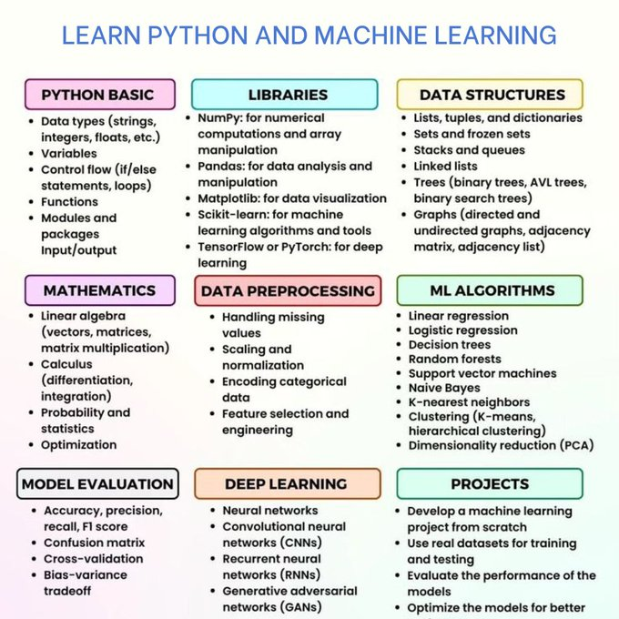
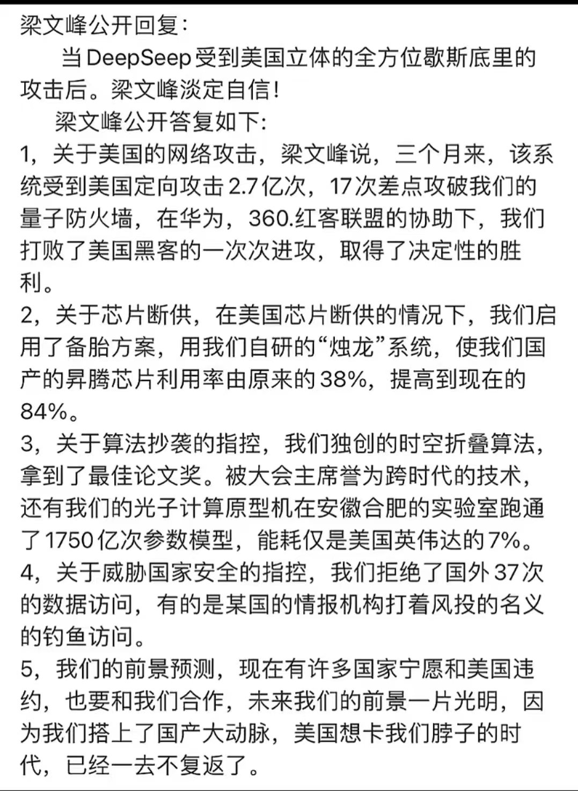

# 好好说话

2025年1月23日，早上坐地铁上班，到地铁客运中心换乘地铁1号线（湘湖-萧山国际机场方向）列车去文海南路去上班。在客运中心换乘的时候发生了一件很不痛快的事情。

换乘的时候，我在等1号线湘湖-萧山国际机上方向的列车，车子到了，我上了车，另外一个阿姨直接坐上一个座位，并且还占了一个座位。我说，“你不能另一个人还没到就开始占座吧”。她大声对我说，“她是孕妇！”听到这里我就直接找其他的座位了。我在别的座位上刚坐下，用眼睛白冷了她一眼。

发生今天这个事情主要的原因是，自己还是不够大度，还是要谦让。况且她还是为比自己年长的阿姨。下次这种情况，自己直接找其他的座位，或者站着，又累不着自己。

让自己不痛快的点在于那个阿姨没有好好说话。她哪管对我平声说，“我女儿怀孕了。”说到这里，我也会立马让座。不会再做到别的座位上还白冷了她一眼。

总而言之，还是自己的观察能力不够，不懂得谦让，实属是需要提升的能力呀！还有就是自己的反应能力还是要增强，脑子还是要更快些才好，话也得赶趟。

### 工具
- 【免费API】[免费的企业级 Deepseek R1 API ](https://build.nvidia.com/explore/discover)
- 【日历】[2023-2025中国节假日、调休、补班日历](https://github.com/lanceliao/china-holiday-calender)
- 【搜素】[meilisearch](https://github.com/meilisearch/meilisearch)
  - https://www.meilisearch.com/
- 【本地发送文件】[localsend](https://github.com/localsend/localsend)
- [magic-wormhole](https://github.com/magic-wormhole/magic-wormhole)
- 【设计】[canva](canva.com)
  - https://canva.cn
- 【系统监控】[监控所有服务的服务uptime kuma](https://github.com/louislam/uptime-kuma)
  - https://uptime.kuma.pet/
- 【工具】[Open source Spotify client](https://github.com/KRTirtho/spotube)
- 【游戏开发工具】[Open-source game development software](https://github.com/4ian/GDevelop)
  - https://gdevelop.io/zh-cn
- 【白板工具】[excalidraw](https://github.com/excalidraw/excalidraw)
- 【应用】[Modern open-source time-tracking app](https://github.com/solidtime-io/solidtime)
- 【开源软件】[很好用的开源安卓软件](https://github.com/xlucn/oh-my-foss-android)
- 【工具】[硅基流动](https://account.siliconflow.cn/login)
- 【软件】[一款开源免费的安卓电视直播软件：mytv-android](https://github.com/sakana164/mytv-android)
- 【软件】[NginxUI](https://github.com/0xJacky/nginx-ui)
  - https://nginxui.com/zh_CN/
- 【软件】[Apache Airflow](https://airflow.apache.org/)
- 【工具】[DeepSeek R1 is now live on Azure AI Foundry and 
@GitHub](https://azure.microsoft.com/en-us/blog/deepseek-r1-is-now-available-on-azure-ai-foundry-and-github/)
- 【AI】[deepseek](https://www.deepseek.com/)
- 【工具】[微信公众号订阅方式，支持私有化部署、微信公众号RSS生成（基于微信读书）v2.x](https://github.com/cooderl/wewe-rss)
- 【工具】[About
A libre lightweight streaming front-end for Android.](https://github.com/TeamNewPipe/NewPipe)
  > 对国内设备非常友好，不需要安装 Google 服务框架也能使用，而且无需登录 YouTube 账号。
- 【工具】AI 工作流平台
  - https://dify.ai/
  - https://www.coze.cn/
  - https://www.langflow.org/
- 【工具】程序员 AI 开发工具
  - https://v0.dev/
  - https://bolt.new/
  - https://www.trickle.so/
- 【工具】[DualSense 在线测试](https://ds.daidr.me/)
  - https://github.com/daidr/dualsense-tester
- 【工具】[Comfortably monitor your Internet traffic](https://github.com/GyulyVGC/sniffnet)
  - https://sniffnet.net/
- 【工具】[PebbleOS](https://github.com/google/pebble)
- 【工具】[开箱即用的 Markdown 简历](https://github.com/BingyanStudio/LapisCV)
- 【电报】[高质量的电报群](https://github.com/jackhawks/rectg)
- 【大模型】[MNN 大模型 Android App](https://github.com/alibaba/MNN/blob/master/project/android/apps/MnnLlmApp/README_CN.md)
- 【工具】[一款实用的 Homebrew 可视化工具：Applite](https://github.com/milanvarady/Applite)
- 【工具】[Enhanced ChatGPT Clone: Features Agents, DeepSeek, Anthropic, AWS, OpenAI, Assistants API, Azure, Groq, o1, GPT-4o, Mistral, OpenRouter, Vertex AI, Gemini, Artifacts, AI model switching, message search, Code Interpreter, langchain, DALL-E-3, OpenAPI Actions, Functions, Secure Multi-User Auth, Presets, open-source for self-hosting. Active project.](https://github.com/danny-avila/LibreChat)

### 课程 & 书籍📚
- 【系统设计】[system design interview](https://github.com/mukul96/System-Design-AlexXu)
- 【Python学习课程】
  
- 【论文】[Foundations of Large Language Models](https://arxiv.org/abs/2501.09223)
- 【实时视频音频工具】[livekit](https://github.com/livekit/livekit)
- 【课程】[MIT 6.5630 Advanced Topics in Cryptography, Fall 2023](https://www.youtube.com/playlist?list=PLUl4u3cNGP61EZllk7zwgvPbI4kbnKhWz)
  - [Advanced Topics in Cryptography](https://ocw.mit.edu/courses/6-5630-advanced-topics-in-cryptography-fall-2023/)
- 【书籍】[数学与生活系列图书](https://book.douban.com/subject/26148739/)
- 【书籍】[这才是好读的数学史](https://book.douban.com/subject/33430525/)
- 【书籍】[数学史·上下](https://book.douban.com/subject/10732014/)
- 【学习资料】[关于学习数据库资料合集](https://github.com/pingcap/awesome-database-learning)
  - [TiDB](https://github.com/pingcap)
- 【课程】[开源免费的大语言模型课程：LLM Course](https://github.com/mlabonne/llm-course)
  - https://mlabonne.github.io/blog/
  - https://github.com/PacktPublishing/LLM-Engineers-Handbook
- 【课程】[LLM-engineer-handbook](https://github.com/SylphAI-Inc/LLM-engineer-handbook)
- 【课程】[Stanford CS234: Reinforcement Learning](https://www.youtube.com/playlist?list=PLoROMvodv4rOSOPzutgyCTapiGlY2Nd8u)
  - [Stanford CS234 Reinforcement Learning I Introduction to Reinforcement Learning](https://www.youtube.com/playlist?list=PLoROMvodv4rN4wG6Nk6sNpTEbuOSosZdX)
- 【课程】[The C Language](https://www.youtube.com/watch?v=ZwqDd-WM4kk&list=PLTbERlX_4R03PpUhJJ-f1cTC-Y_tLucHZ)
- 【书籍】[Linux Kernel in a Nutshell](https://theswissbay.ch/pdf/Gentoomen%20Library/Operating%20Systems/Linux/O%27Reilly%20Linux%20Kernel%20in%20a%20Nutshell.pdf)
- 【课程】[Harvard University just released a free online courses](https://x.com/LearnWithSubhan/status/1885713125653049428)
- 【书籍】[Mathematics for Machine Learning](https://course.ccs.neu.edu/ds4420sp20/readings/mml-book.pdf)
- 【书籍】[10 "C" Programming Books](https://x.com/swapnakpanda/status/1885678521780981779)
- 【书籍】[群体的智慧](https://book.douban.com/subject/4924898/)
- 【书籍】[如何学习](https://book.douban.com/subject/27081766/)
- 【书籍】[A Malloc Tutorial](https://wiki-prog.infoprepa.epita.fr/images/0/04/Malloc_tutorial.pdf)
- 【课程】[Introduction to Computational Thinking and Data Science](https://ocw.mit.edu/courses/6-0002-introduction-to-computational-thinking-and-data-science-fall-2016/)
  - [课程视频](https://www.youtube.com/playlist?list=PLUl4u3cNGP619EG1wp0kT-7rDE_Az5TNd)
- 【课程】[Linear Algebra](https://ocw.mit.edu/courses/18-06sc-linear-algebra-fall-2011/)
  - [课程视频](https://www.youtube.com/playlist?list=PL221E2BBF13BECF6C)
- 【课程】[DeepMind x UCL | Reinforcement Learning Course 2018](https://www.youtube.com/playlist?list=PLqYmG7hTraZBKeNJ-JE_eyJHZ7XgBoAyb)
- 【视频课程】[How does Linux Runs Executable?](https://x.com/chessMan786/status/1885033894053114030)
- 【书籍】[会走路的钱·上下](https://book.douban.com/subject/34977252/)
- 【书籍】[分布式系统模式](https://martinfowler.com/articles/patterns-of-distributed-systems/)
- 【课程】[OS in 1000 lines](https://operating-system-in-1000-lines.vercel.app/zh/)
- 【书籍】[智人之上(Nexus)](https://book.douban.com/subject/37001305/)
- 【资源】[Some useful websites for programmers.](https://github.com/sdmg15/Best-websites-a-programmer-should-visit)
- 【课程】[Unified Efficient Fine-Tuning of 100+ LLMs & VLMs ](https://github.com/hiyouga/LLaMA-Factory)
- 【书籍】Writing a C Compiler: Build a Real Programming Language from Scratch
- 【课程】[英伟达开源课程](https://sp-events.courses.nvidia.com/dli-india25?ncid=ref-inpa-419622)
- 【阅读清单】[DeepSeek R1 阅读清单](https://github.com/ninehills/blog/issues/121)

### 好文 & 经典博客 blog
- 【deepseek 公开回复】
  
- 【博客】[The Ultimate 2025 AI Engineer Reading List](https://www.latent.space/p/2025-papers)
- 【文章】[13 Must Read Software Development Books for Experienced Developers](https://dev.to/somadevtoo/13-must-read-software-development-books-for-experienced-developers-4ema)
- 【文章】[o3-mini 蛇年初三发布](https://openai.com/index/openai-o3-mini/)
- 【文章】[搭建免费的企业邮箱](https://javayhu.com/da-jian-mian-fei-de-qi-ye-you-xiang-gmail-resend-cloudflare/)
- 【文章】[How I Mastered Data Structures and Algorithms](https://blog.algomaster.io/p/how-i-mastered-data-structures-and-algorithms)

### 英语学习
- 【网站】[newsela](https://newsela.com/)

### 设计 
- 【字体】[霞鹜开源免费字体一览](https://github.com/lxgw)