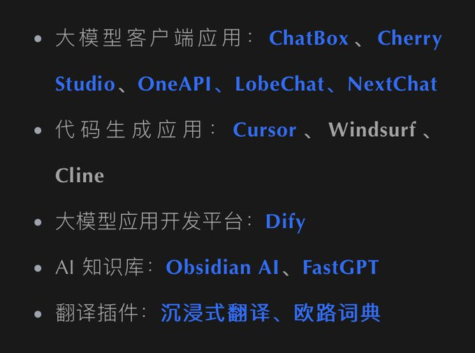
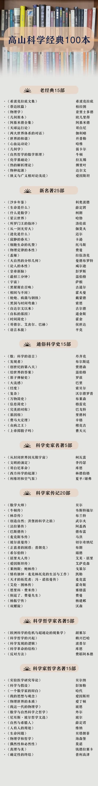
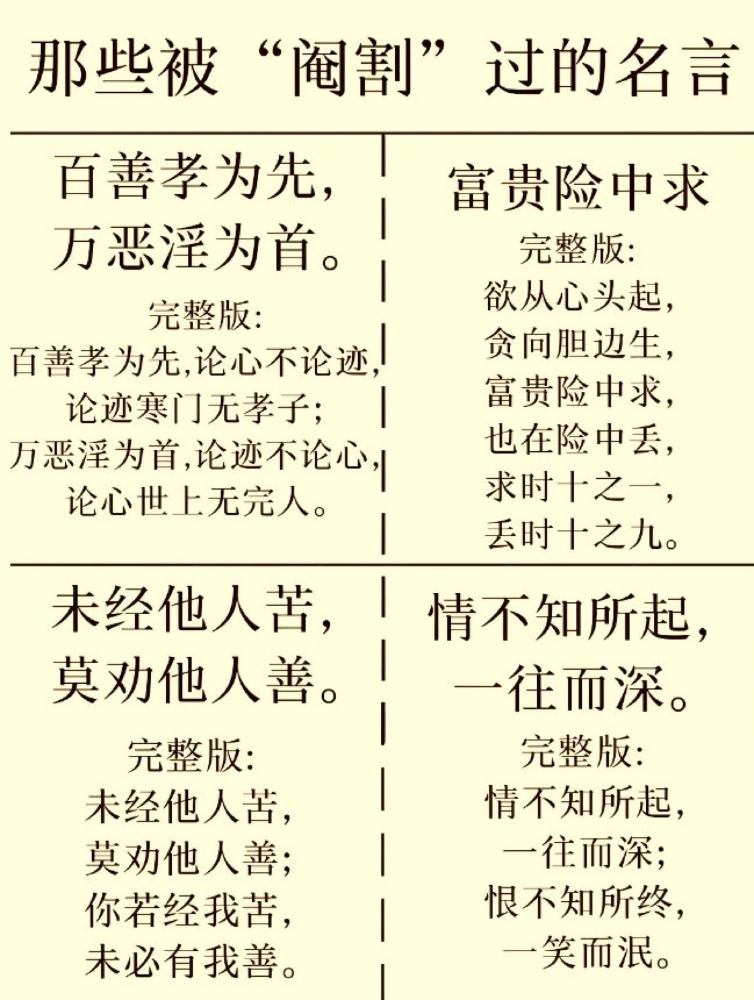
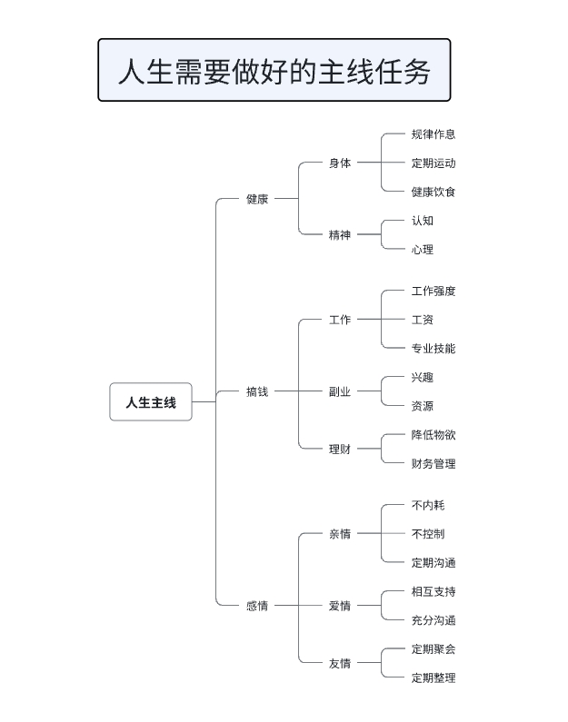
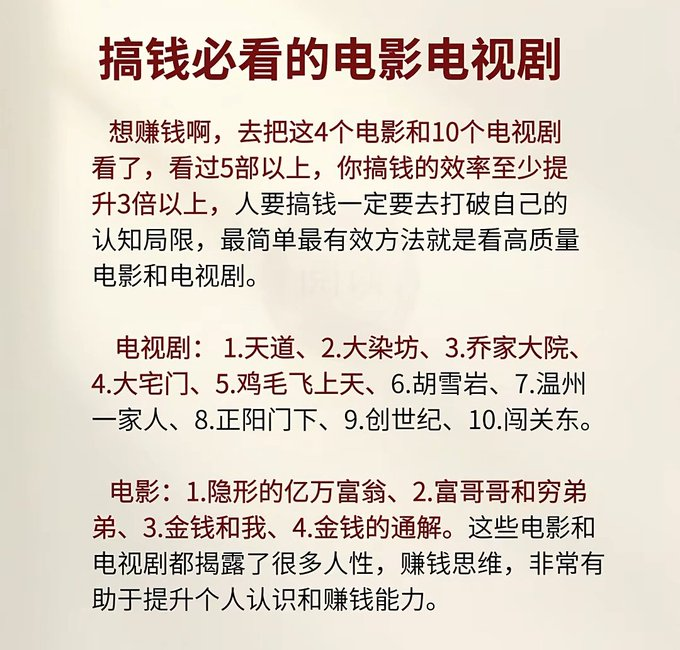

# 自洽的程序员

- [电影票房 DashBoard](https://piaofang.maoyan.com/dashboard)

> [《自洽的程序员》](https://www.dev-life.site/) 是一本不错的书，也可以下载 [pdf 版本](./book/ziqiadechengxuyuan.pdf), 下面是这本书的简介：
>
> 这不是一本技术书
>
> 首先，这不是一本程序员的技术书籍，整本书不会提及任何一个技术词汇，这也不是一本教你如何规划职业生涯，如何在职场走个更远的书，虽然我相信大部分内容确实有助于在职场的发展。
>
> 但这本书的真正用意是想解决工作过程中碰到的焦虑、倦怠、迷茫、抑郁等情绪，聚焦于解决具体问题，通过改变认知将我们从负面情绪的泥淖中走出来，做到更坦然，真诚的面对自己的内心，成为一个自洽的程序员。
>
> 总而言之，这不是一本成功学的书，它不会教你如何赢，笔者本身也不是一个世俗意义上成功的人，而是一本帮你梳理情绪，转变心境的书。

## 大模型

- 【语音】[小红书开源了其最新语音识别模型：FireRedASR，擅长识别中英文、方言/歌词，在公共普通话 ASR 基准测试中达到了新的最佳水平](https://github.com/FireRedTeam/FireRedASR)
- 【提示词】[网络安全 8 大领域 AI 提示词](https://mp.weixin.qq.com/s/KdFiuo01btdF6bmGcoPpQA)
- 【大模型】[Memobase is a user profile-based memory system designed to bring long-term user memory to your Generative AI (GenAI) applications. Whether you're building virtual companions, educational tools, or personalized assistants, Memobase empowers your AI to remember, understand, and evolve with your users.](https://github.com/memodb-io/memobase)
- 【百炼】[百炼大模型](https://bailian.console.aliyun.com)
- 【字节跳动】[Enio - 字节跳动开源的大型语言模型（LLM）应用开发框架](https://github.com/cloudwego/eino)
- 【卡通】[ToonCrafter: Generative Cartoon Interpolation](https://github.com/Doubiiu/ToonCrafter)
- 【PandaAI】[Chat with your database or your datalake (SQL, CSV, parquet). PandasAI makes data analysis conversational using LLMs and RAG.](https://github.com/sinaptik-ai/pandas-ai)

## 软件

- 【工具】[The second fastest AI chatbot™](https://chatwise.app/)
- 【工具】[elmo.chat](https://apps.apple.com/us/app/elmo-chat/id6740473858)
- 【VSCode 插件】[Swift 终于有正式的 VS Code 扩展了](https://marketplace.visualstudio.com/items?itemName=swiftlang.swift-vscode)
- 【向量数据库】那些开源的向量数据库
  - https://github.com/pgvector/pgvector
  - https://github.com/facebookresearch/faiss
  - https://milvus.io/
  - https://www.pinecone.io/
  - https://weaviate.io/
  - https://github.com/spotify/annoy
  - https://github.com/nmslib/hnswlib
  - https://vespa.ai/
  - https://qdrant.tech/
- 【工具】[一款开源的视频字幕翻译工具：VideoCaptioner](https://github.com/WEIFENG2333/VideoCaptioner)
- 【工具】[带有 PDF 注释的手写笔记软件-xournalpp](https://github.com/xournalpp/xournalpp)
- 【AI 生成检测工具】
  - [腾讯搞了个 AI 生成检测](https://matrix.tencent.com/ai-detect/ai_gen_txt)
  - https://gptzero.me/
  - https://originality.ai/
  - https://isgpt.org/
- 【工具】[OpenHealth, AI Health Assistant](https://github.com/OpenHealthForAll/open-health)
- 【工具】[deepseek.ai](https://chat.scnet.cn/#/home)
- 【工具】[DeepSeek 集成](awesome-deepseek-integration)
- 【工具】大模型 Client 端

  

- 【工具】[南大 Docker 镜像](https://sci.nju.edu.cn/9e/05/c30384a564741/page.htm)
- 【工具】[rnote](https://github.com/flxzt/rnote)
- 【工具】[BeeSync](https://github.com/BeeSyncAI/BeeSync)
- 【工具】[一个学术论文转播客的工具：Podcast，自带学习功能，可以根据用户反馈改进](https://github.com/artnoage/Podcast)
- 【工具】[A one stop shop for fine tuning and testing LLMs locally using the best tools available.](https://github.com/MaxHastings/Kolo)
- 【工具】[ezBookkeeping is a lightweight personal bookkeeping app hosted by yourself.](https://github.com/mayswind/ezbookkeeping)
- 【工具】[About Polaris is a music streaming application, designed to let you enjoy your music collection from any computer or mobile device.](https://github.com/agersant/polaris)
- 【工具】[About Tinkerpad is a lightweight and fast PHP playground that works with Docker and SSH](https://github.com/epessine/tinkerpad)
- 【工具】[Discover all your favorite radio stations](https://theonestopradio.com/)
- 【工具】[Edit, Resize, and Filter any photos](https://shoteasy.fun/)
- 【工具】[Create rich visualizations with AI](https://github.com/microsoft/data-formulator)
- 【工具】[开源的电子书阅读器-readest.com](https://github.com/readest/readest)
- 【工具】[DistillFlow](https://github.com/horus-ai-labs/DistillFlow/)
- 【工具】[飞书转换大师是一款能够将飞书文档一键转换为微信公众号排版格式的工具，支持多种样式和组件，简化排版流程，提高创作效率](https://feishu2weixin.funwithbuild.com/)
- 【工具】[About The media player for language learning, with dual subtitles, AI-generated subtitles, realtime-OCR, translation, word lookup, and more!](https://github.com/umlx5h/LLPlayer)
- 【工具】[tiktok、B 站等视频下载工具](https://snapany.com/zh)
- 【工具】[pdf-to-podcast](https://github.com/NVIDIA-AI-Blueprints/pdf-to-podcast)
- 【工具】[Open-source GenBI AI Agent that empowers data-driven teams to chat with their data to generate Text-to-SQL, charts, spreadsheets, reports, and BI. ](https://github.com/Canner/WrenAI)
- 【工具】[open source tool to monitor mobile apps-measure](https://www.measure.sh/)
- 【工具】[高性能云原生分布式文件系统-juicefs](https://juicefs.com/en/)
- 【工具】[密塔搜索](https://metaso.cn/)
- 【工具】[Meetily - AI-Powered Meeting Assistant](https://github.com/Zackriya-Solutions/meeting-minutes)
- 【工具】[OpenAI 接口管理 & 分发系统，改自 songquanpeng/one-api。支持更多模型，加入统计页面，完善非 openai 模型的函数调用。](https://github.com/MartialBE/one-hub)
- 【工具】[query.rs](https://query.rs/)
- 【工具】展示代码工具
  - https://showcode.app/
  - https://www.ray.so/
  - https://snappify.com/
  - https://carbon.now.sh/
- 【工具】还有哪里可以使用 DeepSeek?
  - https://iflow.cn/
  - https://www.wenxiaobai.com/
  - [官网] https://www.deepseek.com/
  - https://yuanbao.tencent.com/
- 【工具】[开源知识库系统 Simba](https://github.com/GitHamza0206/simba)
- 【工具】[在线工具 PhotoFunia，它能瞬间提升你的图片质量！🚀](https://photofunia.com/)
- 【工具】[一个基于 AI 强大的有声书工具集：LiberSonora](https://github.com/LiberSonora/LiberSonora)
  - https://libersonora.github.io/

## 课程 & 书籍

> [图灵图书](https://www.ituring.com.cn/)

- 【课程】[HuggingFace 刚刚发布了他们的 AI Agent 课程](https://github.com/huggingface/agents-course)
- 【书籍】[21 本开源书籍](https://flaviocopes.com/access/)
- 【资料】[awesome-cto](https://github.com/kuchin/awesome-cto)
- 【书籍】[Stanford’s CS229 - Machine Learning](./book/main_notes.pdf)
- 【AI 知识】[Datawhale](https://github.com/datawhalechina)
  - https://www.datawhale.cn/home
- 【书籍】极简欧洲史
- 【AI】[DeepSeek：从入门到精通](<./book/DeepSeek从入门到精通(20250204).pdf>)
  - https://www.kdocs.cn/l/caFUbVZSt40Q
  - https://mcneo0lysndy.feishu.cn/wiki/Si5Gw3RPWiObzwkpd38cPIDenFh
- 【系统设计】[系统设计](https://x.com/ashishps_1/status/1887720590653497353)
- 【数学】[Numberblocks](https://www.youtube.com/channel/UCPlwvN0w4qFSP1FllALB92w)
- 【高山科学经典】[100 期的《高山科学经典》](https://pan.baidu.com/s/1ugzp_vFopnfPAqCMn3YgVQ?pwd=perw)

- 【Nginx】[Nginx 开源教程](https://wangchujiang.com/nginx-tutorial/)
  - https://github.com/jaywcjlove/nginx-tutorial
- 【课程】[100 days of ML](https://www.youtube.com/playlist?list=PLKnIA16_Rmvbr7zKYQuBfsVkjoLcJgxHH)
- 【课程】[Maths for ML](https://www.youtube.com/playlist?list=PLKnIA16_RmvbYFaaeLY28cWeqV-3vADST)
- 【课程】[100 Days of DL](https://www.youtube.com/playlist?list=PLKnIA16_RmvYuZauWaPlRTC54KxSNLtNn)
- 【书籍】为自己思考
- 【课程】[你管这破玩意叫网络？](https://www.bilibili.com/video/BV17x6hYZEzJ/?vd_source=901e0b3c23d3cff6094d75383834207f)
- 【课程】[Build an 8-bit computer from scratch](https://eater.net/8bit)
- 【书籍】每周工作 4 小时
- 【课程】[Linux : Zero to Hundred](https://www.youtube.com/playlist?list=PL42xkVsLs7Cm5T-r_UEpp3amTY5GgdugK)
- 【课程】[ECE 4760/5730, Cornell University](https://ece4760.github.io/)
  - [ECE 4760 Designing with Microcontrollers](https://ocw.ece.cornell.edu/courses/ece-4760-designing-with-microcontrollers/)
  - [视频教程](https://www.youtube.com/playlist?list=PLDqMkB5cbBA5oDg8VXM110GKc-CmvUqEZ)
- 【课程】[Extract the Filesystem of a Container Image](https://labs.iximiuz.com/challenges/extract-container-image-filesystem)
- 【书籍】优雅的守卫者
- 【课程】[A 9-Lesson course teaching everything you need to know about harnessing GitHub Copilot as an AI Paired Programming resource](https://github.com/microsoft/Mastering-GitHub-Copilot-for-Paired-Programming)
- 【书籍】Python 工匠

## 计算机基础

- 内存分配

## 名言

- 你知道它的下半句吗？

### 铁娘子

> One's life must matter. Beyond the cooking and the cleaning and the children, one's life must mean more than that. I can't die washing up a tea cpu.
>
> 每个人的声明都有其意义。那是超越煮饭、清洗、照顾孩子，人声明的意义远胜于此。我不能一生终老在洗茶杯上。
>
> Watch your thoughts, for they become your words.
>
> Watch your words, for they become your actions.
>
> Watch your actions, for they become your habits.
>
> Watch your habits, for they become your character.
>
> Watch your character, for it becomes your destiny.
>
> What we think, we become.
>
> Don't ask me what I'm feeling. Just ask me what I'm thinking.
>
> It used to be about trying to do something.
>
> Now it's about trying to be someone.
>
> People don't think anymore, they feel.
>
> One of the great problems of our age is that we're governed by people... who care more about feelings than they do about thoughts and ideas.
>
> 这个时代最大的问题是我们被这样的人领导着。。。他更注重感性思维而不是理性的思考和观点。

### 左耳朵耗子 【博客】[coolshell](https://coolshell.org/)

> Great minds discuss ideas
>
> 卓越之识论道
>
> Average minds discuss events
>
> 平常之识论事
>
> Small minds discuss people
>
> 狹隘之识论人

## 好玩

- 【网络】[Real-time 3D visualization of Nano cryptocurrency networks - Watch live transactions fly across an interactive globe with 🚀 SpaceX-inspired animations](https://github.com/dalindev/XNOHub.com)
  - https://xnohub.com/
- 【效应】蔡格尼克效应
- 【游戏】[超级玛丽](https://github.com/x86matthew/NES-Emulator)

- 【好玩】[google whisk](https://labs.google/fx/zh/tools/whisk)

## 博客

- 【博客】[Sam Altman](https://blog.samaltman.com/)
- 【文章集合】[这是一个简单的技术科普教程项目，主要聚焦于解释一些有趣的，前沿的技术概念和原理。每篇文章都力求在 5 分钟内阅读完成](https://github.com/karminski/one-small-step)
- 【博客】[Alex Xu's Blog](https://blog.bytebytego.com/)
- 【文章】[Linux Performance](https://www.brendangregg.com/linuxperf.html)
- 【文章】[What is Spring Application Advisor? How to Achieve a Continuous Upgrade Culture with Tanzu Spring](https://redmonk.com/videos/what-is-spring-application-advisor-how-to-achieve-a-continuous-upgrade-culture-with-tanzu-spring/)
- 【文章】[发布 Anyshortcut CLI 版以及 Rust 使用半年之后的感受](https://folyd.com/blog/anyshortcut-cli-and-rust/)
- 【文章】[From Chunks to Blocks: Accelerating Uploads and Downloads on the Hub](https://huggingface.co/blog/from-chunks-to-blocks)

## 搞钱必看

## 英语学习

> 【学习方法】[快速掌握英语听力，口语的科学方法！](./book/english%20learning.pdf)

## 管理

### 接受工作，只问标准

领导布置一项工作，一定确认好交付标准再去做，说白了就是搞清楚【**领导希望这项工作达到什么样的效果**】

- 用 SMART 原子快速确认领导要求
  - S(Specific)：具体的，明确具体的指标和细节；
  - M(Measureable)：确保目标可以量化；
  - A(Achievable)：目标可行，不理想化；
  - R(Relevant)：与总目标的相关性；
  - T(Time-bound)：deadline，明确的完成时间；

### 请示工作，必带方案

工作中遇到问题，不要上来就问领导怎么办，而是要带着至少 2 个方案建议，让领导决策。让领导做选择题，而不是问题题。

- 使用 RIDE 说服模型，说服老板支持你
  - R(Risk)：风险、目前的困难；
  - I(Interest)：利益、引入共同的利益；
  - D(Difference)：差异，A 方案和 B 方案的区别；
  - E(Effect)：影响，适当体现一些缺点（全挑好的说不真实）

> 举例：领导，这次用户运营策略入宫不进行迭代，我们将无法完成季度指标（风险），策略 A 风险小且有很大概率能提升用户留存率（利益），这个方案比策略 B 更加弹性，可以随时根据实时数据反馈进行调整(差异)，当然，也需要消耗一些活动推广成本（影响）

### 汇报工作，突出结果

结论先行，汇报时先说结论，再说原因，接着用事例辅助证明观点，最后重复结论，工程一次完整的表述。

- PREP 汇报模型
  - P(Point)：结论先行，上来就给结论，直击重点
  - R(Reason)：再讲理由，陈述原因，给出有说服力的依据
  - E(Example)：拿出事例，最好给一个事例
  - P(Point)：将发散的思维回归结论，强化观点

### 分享工作，细说流程

如果领导让你跟团队分享经验，一定要多维度分析，不可泛泛而谈

- 5W2H 法则-业务/产品分析
  > 从 7 个维度思考，广泛应用于产品、业务、项目运营、可行性分析，问题解决和落地方法论
  - What: 产品背景
  - Who：目标人群
  - Why：预期目标
  - Where：使用场景
  - When：需求节点
  - How：如何验证
  - How much：用多少资源，投入产出比

### 复盘工作，总结 SOP

不会复盘 = 低质量重复 = 无法总结出底层逻辑和规律

- GRAI 法则，超厉害工作复盘模型
  - G(Goal)：回顾目标
  - R(Result)：评估结果、方向校准、数据验证
  - A(Analysis)：分析成功/失败原因，表层/深层原因，偶发性和必然性
  - I(Insight)：总结规律、形成可以复用的方法论（SOP）

> **注意**：对项目、团队有用的文档、流程及时分享，强烈建议做成 SOP。（凸显你的将本增效思维，团队协作意识）

## 播客

- 【播客】[teahour](https://teahour.fm/)

## 云服务

- 【云服务】[CLAWCLOUD](https://claw.cloud/)
