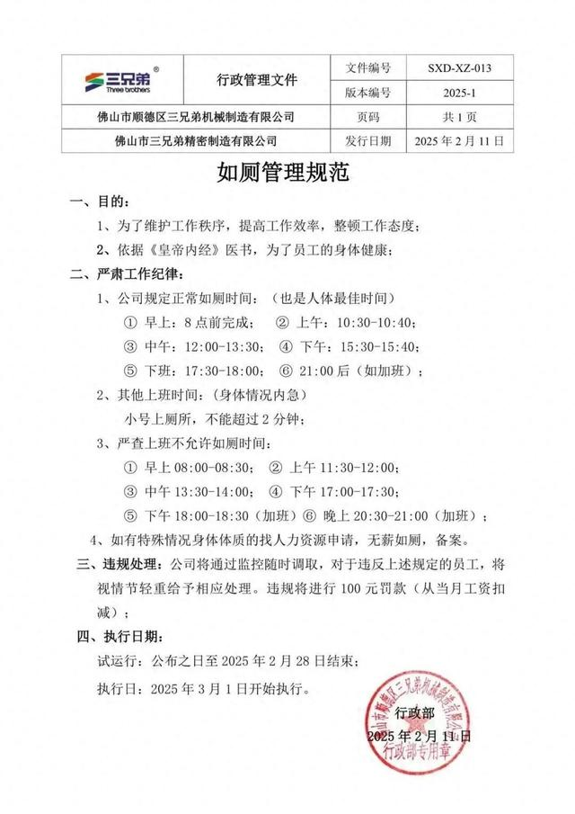

# 员工如厕时间规范

> 据羊城晚报，2月11日，广东佛山一公司发布《如厕管理规范》，称为提高效率、整顿工作态度，依据《黄帝内经》医书，规定了最佳如厕时间。例如，10:30-10:40期间员工可正常如厕，11:30-12:00期间则不允许如厕。而在未规定的其他上班时间“小号上厕所”，则不能超过2分钟。此外，公司将通过监控随时调取，对于违反上述规定的员工，将视情节轻重给予相应处理。违规将进行100元罚款（从当月工资扣减）。

该公司于2月13日撤销如厕规定

其实，如厕时间纳入公司管理，并非孤例。据三湘都市报，多个社交平台的都有网友对企业“厕所制度”吐槽的发帖，有的上厕所前要写申请表，有的上厕所要问领导拿钥匙，还有的上大号要报备、超过20分钟当天一律“停单”处理。

根据我国《劳动法》第三条规定，劳动者享有休息休假的权利、获得劳动安全卫生保护的权利。有律师认为，员工作为劳动者一方，什么时间上厕所，使用厕所的便利不仅是属于员工休息的权利，亦属于劳动安全卫生保护的内容；故在工作条件中，用人单位应当保障员工上厕所的权利，为员工提供必要的卫生设施，并保障员工在工作期间能够合理使用卫生设施。而根据《劳动合同法》第4条规定，用人单位在制定、修改或决定有关劳动报酬、工作时间、休息休假、劳动安全卫生等重大事项时，应当经职工代表大会或全体职工讨论，提出方案和意见，与工会或职工代表平等协商确定；《劳动合同法》第32条则规定，劳动者对危害生命安全和身体健康的劳动条件，有权对用人单位提出批评、检举和控告。

在实际的劳务纠纷中，就有企业因为员工离岗如厕3分钟开除员工的案例，该员工认为公司解除劳动关系的行为违法，要求公司支付违法解除赔偿金。对此，法院认为，员工该行为系正常生理现象并非主观逃班行为，同时员工也联系了其他同事在如厕时顶岗，不存在故意或重大过失，判决该公司支付员工违法解除劳动关系赔偿金6万余元。

在合理合法的前提下，用人单位有权根据自身需要制定章程规范，但应兼顾人文关怀，通过关爱员工、尊重员工的方式来塑造和谐的劳资关系。如果为防员工“摸鱼”进而要求如厕时间精准到2分钟，效果适得其反。过度管控的方式，会导致士气低落、影响团队合作。

> 原文链接：https://finance.sina.com.cn/jjxw/2025-02-14/doc-inekmuie7354871.shtml

## 新闻

- 【环球网科技综合报道】2月16日消息，OpenAI首席执行官Sam Altman宣布，GPT 4o的智力水平将提升至o3 pro级别，并且他认为更新后的GPT 4o是目前最佳的AI搜索产品。
- 【环球网科技综合报道】2月13日，荣耀DeepSeek-R1联网版正式上线，首批支持机型包括荣耀Magic7系列及部分折叠屏机型。
- 地理信息产业跑出新赛道
  > 浙江湖州德清县的智能网联汽车测试场内，排满了等待测试的车辆。
  >
  > 这是浙江省内唯一同时满足单车智能和智能网联测试的公共测试场，引得众多车企纷至沓来。
  > 
  > 智能网联汽车测试，是地理信息产业在德清县衍生出的新业态之一。位于县城南部的地理信息小镇，是德清县地理信息产业的集聚地。
  > 
  > 在浙江国遥地理信息技术有限公司遥感大数据应用研究中心，工作人员正在处理和分析遥感数据。“我们建立了覆盖全国的航空遥感网，提供信息服务，销售额不断增长。”浙江国遥地理信息技术有限公司总经理杨为琛说。
  > 
  > 如今，地理信息小镇已入驻相关企业430余家，集聚莫干山地信实验室、地磁大科学装置研究院、中国科学院微波特性测量实验室等科创载体，配套国际会议中心、展览中心、地理信息科技馆等一批基础设施和60余幢产业大楼。
  > 
  > “地理信息小镇已成为全国地理信息产业集聚度最高、创新能力最强、国际化程度最高的区域之一。”湖州莫干山高新区地信发展中心副主任陈燕红介绍，这里是首届联合国世界地理信息大会举办地、联合国全球地理信息知识与创新中心落户地、中国测绘地理信息大会永久举办地。
  > 
  > 以地理信息产业为基石，德清县近年来努力做优做强以“地理信息+车联网”为特色的数字经济，2024年成功入选工业和信息化部等5部门智能网联汽车“车路云一体化”首批试点。当前，德清县打造了双向600公里的智慧道路，完成具备自动驾驶数据处理和协同监管的城市智能网联云控平台建设。
  > 
  > 2024年7月，德清县启动地理信息“造峰行动”，力争通过3年努力，推动“地理信息+”产业规模突破600亿元。
  > 
  > 德清县委书记王波表示：“我们将把地理信息产业作为创新发展的新赛道，加快形成竞争新优势、发展新动能。”

- 第十七届中原（鹤壁）民俗文化节暨浚县正月古庙会大型社火展演