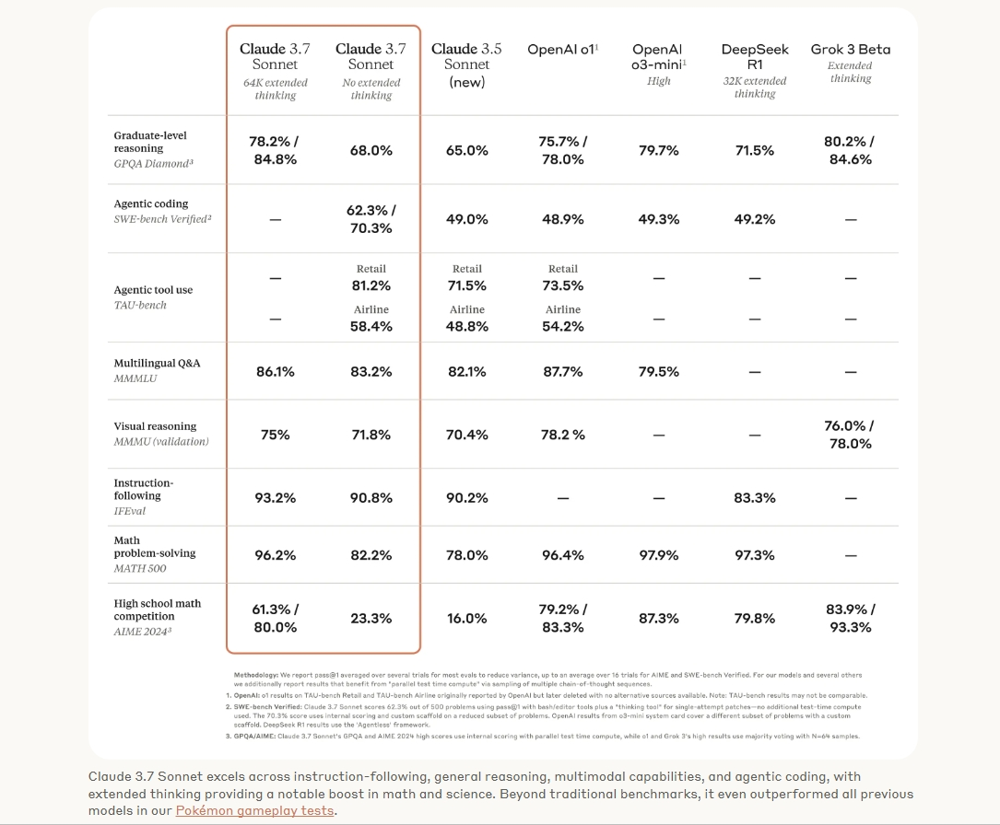

# Claude 3.7 Sonnet and Claude Code

## 模型对比

## 英语学习

- https://github.com/knowledgefxg/learning-english
- https://bearliu.substack.com/p/beartalk-8

## 工具

- https://github.com/satnaing/shadcn-admin
- https://github.com/heyform/heyform
- Notion 平替： https://github.com/suitenumerique/docs
- https://github.com/microsoft/typescript-go
- https://github.com/tangly1024/NotionNext
- https://free-for.dev/#/
- https://github.com/dagger/dagger

## 字体

- https://github.com/subframe7536/maple-font

## 读书

- 真想让我爱的人读读这本书
- 蓝筹孩子
- 效率脑科学
- 技术科普教程：https://github.com/karminski/one-small-step
- 苏世民·我的经验与教训
- 世界秩序
- 债务危机
- 未来简史

## 课程

- 线性代数·Gilbert Strang

## 搞钱纪录片

## 摄影

- [青春少女拍摄指南](https://pan.quark.cn/s/8da88ed56167#/list/share)
- [富士相机摄影课](https://pan.quark.cn/s/8b44a7ca5f6a#/list/share)

## 项目管理

- https://github.com/makeplane/plane

## 网页设计

- https://www.curated.design/
- https://www.landing.gallery/
- https://saaslandingpage.com/
- https://www.supahero.io/
- https://mobbin.com/
- https://www.dark.design/

## 游戏

- https://github.com/skywind3000/preserve-cd
