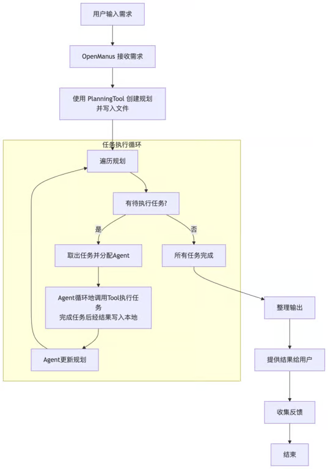
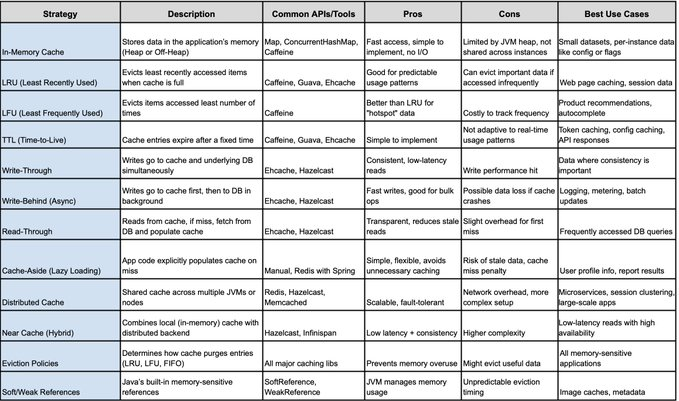

# Manus is a general AI agent that turns your thoughts into actions.


## 工具

- [发现了一款简洁高效的 Jellyfin 移动客户端：Streamyfin。支持跳过片头片尾、视频预览、后台播放和离线下载。](https://github.com/streamyfin/streamyfin)
- [ransparent proxy server for llama.cpp's server to provide automatic model swapping](https://github.com/mostlygeek/llama-swap)
- [可以让 Claude 直接与 Blender 对话的 MCP：blender-mcp，通过文字提示即可创建 3D 场景](https://github.com/ahujasid/blender-mcp)
- [Refly 正式发布 0.4.0，让 AI Native 内容创作引擎更近一步，你现在可以在一处工作空间完成上下文的处理、Claude 3.7 thinking 交互，还能生成海报、PPT、文档或酷炫的网页](https://github.com/refly-ai/refly)
- [RGA-Gurubase](https://github.com/Gurubase/gurubase)
- [单词](https://github.com/SteveSuv/remix-words-funny)
- [devops 相关](https://github.com/wmariuss/awesome-devops)
- [用 LLM 转 pdf 为 word](https://github.com/jorben/markpdfdown)
- [Obsidian + AI](https://www.bilibili.com/video/BV1MkQdYVEhp/)
- [UI copy 工具](https://same.new/)
- [fastexcel](https://github.com/fast-excel/fastexcel)
- [Python tool for converting files and office documents to Markdown.](https://github.com/microsoft/markitdown)
- https://github.com/ocrmypdf/OCRmyPDF
- [城市租房生存指南](https://zufang.ababtools.com/)
- [苦于微信群聊二维码频繁变动，开发这个能生成永久二维码的工具，不需要服务器。也可作为 URL 缩短链接服务使用](https://github.com/xxnuo/serverless-qrcode-hub)
- https://md2card.com/zh/editor
- https://github.com/ZGGSONG/STranslate
- https://github.com/subframe7536/maple-font
- https://github.com/jianchang512/clone-voice
- https://github.com/jiangrui1994/CloudSaver
- 40 Sites to Download Books for free

```
1. Planet eBook
2. Free-eBooks. net
3. ManyBooks
4. LibriVox
5. Internet Archive
6. BookBub
7. Open Library
8. BookBoon
9. Feedbooks
10. Smashwords
11. Project Gutenberg
12. Google Books
13. PDFBooksWorld
14. FreeTechBooks
15. Bookyards
16. GetFreeBooks
17. eBookLobby
18. FreeComputerBooks
19. OpenCulture
20. Library Genesis (LibGen)
21. Goodreads
22. Obooko
23. O'Reilly
24. PDF Drive
25. Anna's Archive
26. PDF Room
27. PDF Coffee
28. Dokumen Pub
29. Z Library
30. Ocean of PDF
31. Dirzon
32. Booksfree
33. EngbooksPDF
34. Elejandria
35. Espaebook
36. Wonderful Books
37. Lectuland
38. LeerLibrosOnline
39. ePubLibre
40. Standard Ebooks
```

- 一人公司 AI 工具集合 - 第三弹

```
日常工具篇

通用
http://raycast.com（免费够用）
• 现在立刻马上，取代默认的 Spotlight 搜索
• 全能，分屏，翻译，游戏，字典，命令，只有你想不到没有它办不到

窗口管理
http://rectangleapp.com （免费）
• 适合从 Win 转 Mac 的朋友

截屏
http://snipaste.com （免费）
• 用了很多年，简单易用
• 截屏的时候还可以检测配色

Gif 截屏
http://getkap.co  （开源免费）
• 支持高清导出，可选多个 fps，可选格式

键盘按键显示
http://github.com/keycastr/keycastr  （开源免费）
• 屏幕显示键盘按键

录屏
http://obsproject.com （开源免费）
• 录屏软件，不用过多介绍了

下载视频
http://software.charliemonroe.net/downie （免费试用）
• 长视频，短视频，多平台，能下的可以，18+ 的也可以

播放器
http://iina.io （开源免费）
• 时尚好用

系统工具栏 toolbar 自定义
http://github.com/jordanbaird/Ice（开源免费）
• 自从刘海屏幕之后，这个东西就是必须要有

硬核快捷键修改
http://karabiner-elements.pqrs.org （开源免费）
• 硬核快捷键，鼠标，触摸板编辑软件

命令行
http://warp.dev （免费够用）
• AI 命令行工具，支持正常语言理解命令行

剪贴板
http://tapbots.com/pastebot （13刀，终身）
• 用了很多年的剪切板工具，多台机器可用
• 支持截图也可以放进剪切板
• 我快捷键唤醒 cmd + shift + v，太方便了

多功能自定义截屏
http://cleanshot.com（8刀/月，29 终身）
• 其实有了上面的工具就不需要 cleanshot 了
• 但是截图，gif 等体验优化还是不错

订阅工具集合
http://setapp.com （10刀/月）
• 一个订阅，多种服务，包含各种小工具
```

## 设计

- [插画网站](https://vectorcraftr.com/)

## 书籍

- [exploring-js-screen-preview](./book/exploring-js-screen-preview.pdf)
- 汽车是怎么跑起来的
- [Oxford Picture Dictionary, 3rd Edition](https://pan.quark.cn/s/bf0c8fadc3d9)
- 斯坦福 — 极简经济学
- 专注的真相
- [小孔龙乐园](https://t.co/goyHFoNSd5)
- [Zig and Zag](https://t.co/oh1jeDGcSb)
- 你是你吃出来的
- [分布式系统](https://www.youtube.com/playlist?list=PLeKd45zvjcDFUEv_ohr_HdUFe97RItdiB)

## 设计

```
OpenManus 核心作者分享了主要的设计思路和工作流程：

1. 极简可插拔框架： OpenManus 的核心设计是构建一个非常精简的 Agent 框架，强调模块化和可扩展性。它通过可插拔的工具 (Tools) 和提示词 (Prompt) 的组合来定义 Agent 的功能和行为，降低了开发和定制 Agent 的门槛。

2. 工具驱动的 ReAct Agent: OpenManus 基于 ReAct (Reason + Act) 模式，并以工具为核心驱动 Agent 的行动。Prompt 引导 Agent 的推理和逻辑，而 Tools 则赋予 Agent 行动能力。ToolCall Agent 的引入，进一步提升了工具使用的效率和规范性。

3. 规划能力处理复杂任务: OpenManus 继承 Manus 的规划优势，利用 PlanningTool 将复杂的用户需求分解为线性的子任务计划。这种规划能力是处理现实世界复杂问题的关键，使得 Agent 能够逐步分解并解决大型任务。

4. 动态 Agent 任务分配: 在执行任务计划时，OpenManus 采用动态 Agent 分配机制。系统会根据每个子任务的具体需求，临时分配最合适的 Agent 来执行，Agent 预先装备了不同的工具集以应对不同类型的任务，提高了系统的灵活性和效率。

5. 工作流程  规划 -> 分配 -> 执行: OpenManus 的工作流程清晰高效。首先通过 PlanningTool 生成任务计划；然后，针对计划中的每个任务动态分配 Agent；最后，被分配的 Agent 利用自身工具集执行任务。目前 Agent 分配基于正则匹配，未来考虑使用 LLM 实现更智能的任务分配。
```



## 技术文章

- [Hacker New 中文](https://hn.aimaker.dev/)
- [Github 超 2 万星，OpenManus 核心作者聊 Agent 发展趋势](https://www.bestblogs.dev/article/3cb63c)
- https://lilianweng.github.io/posts/2023-06-23-agent/
- https://spectrum.ieee.org/6g-bandwidth
- https://blog.roboflow.com/rf-detr/
- https://github.com/roboflow/rf-detr
- https://onevcat.com/



- 搞钱必看


```
来自一位资深软件工程师的质疑：大语言模型（LLM）真的提高了程序员的效率吗？
作者：Thane Ruthenis

---

过去两年，大语言模型（LLM）编程辅助工具火了。很多程序员兴奋地表示，它们让自己的工作效率提高了好几倍，甚至有人说提高了5倍、10倍。

但奇怪的是，整个软件行业并没有真正出现这么夸张的效率提升。我们用的软件并没有变得特别好用，也没看到更多更厉害的功能出现。如果真的有5-10倍的效率提升，难道不应该有更明显的变化吗？

5-10倍的效率，到底去了哪儿？

理论上，LLM工具可能确实能让少部分非常擅长使用它的人效率大增。但现实中，这种增益似乎极不平均，普通开发者并没有真正享受到明显的提升。实际情况往往是：

- 如果你只是在做一些简单的重复任务，LLM工具确实能帮到你；
- 但一旦涉及复杂的问题或新的项目，这些工具经常需要大量的后续调整和修改，甚至可能比自己从头写还要麻烦。

换句话说，也许你从LLM那里“省下”的几个小时，很可能又得花回去，用来修复那些自动生成但问题一大堆的代码。

为什么我什么也没看到？

我曾以为是我自己孤陋寡闻，没注意到实际的进展，于是特意做了一些深入调查。然而，令人失望的是，我并没找到任何真正令人信服的案例，来证明LLM确实带来了显著的现实进步：

- 各大人工智能公司推出的用户界面依然非常简单粗糙，除了对话框、上传文件之外，几乎没有什么真正有创意的新功能。
- 所谓的“生产力提升”似乎主要体现在一些宣传或小型实验上，而不是实际投入使用的大型项目中。

所以，LLM到底创造了什么实际价值？

我非常好奇的是，如果真的有人靠LLM达到了5-10倍的效率提升，那么具体是什么项目或者产品因此快速诞生了呢？有没有哪项技术或功能，在没有LLM之前，根本不可能这么快出现？

但目前来看：

- 没看到软件界涌现更多创新产品；
- 没有出现更多好用的新功能；
- 没有明显改善我日常使用的软件质量。

甚至连各大AI实验室推出的产品，都没有真正体现出用LLM带来的开发速度提升。

一个“阴谋论”假设：

我斗胆提出一个大胆的猜测：**LLM可能并没有真正提高程序员的整体生产力**，真实情况可能是：

- 你从LLM那里节省的时间，最终又全部浪费在了调整和修复代码上；
- 代码规模稍大后，LLM生成的代码常常变得复杂难懂甚至混乱不堪，最后你可能得彻底重来；
- LLM帮助开发的新项目，多半都是没人用的小玩意，或毫无意义的重复产品；
- LLM生成的代码容易膨胀，使得软件变得臃肿低效。

很多人觉得LLM提高了效率，可能只是因为这种“用自然语言提出需求、立刻看到代码生成”的神奇体验所带来的错觉。但长期来看，这些代码可能并不实用，也并未真正带来整体效率的提高。

那么LLM的真实价值在哪里？

我并不是完全否认LLM的作用，它们在某些情况下确实有帮助，比如：

- 帮助初学者快速入门；
- 简单功能或模板代码的生成；
- 某些特殊的小型任务或简单的重构工作。

但这些都远没有达到所谓的“5-10倍”的夸张程度，实际效率提升可能只有10%-30%左右。

未来会改变吗？

或许真正的突破，只有等到AGI（通用人工智能）诞生的那一天，才能实现。在此之前，LLM对程序员的真正生产力提升可能会一直停留在目前这个水平。

当然，我也希望有人能推翻我的这个“阴谋论”，告诉我真正的情况比我想象的更好。

你怎么看？
```

- 原文链接：https://www.lesswrong.com/posts/tqmQTezvXGFmfSe7f/how-much-are-llms-actually-boosting-real-world-programmer

```
围绕 MCP 生态可以做的一套基建方案👇

1. omcp 命令行工具。本地运行各类 mcp server，暴露 sse http 接口给到上游调用，支持终端 chat，类似 ollama。

比如：omcp run github，启动 mcp-server-github，让你可以本地管理你的 GitHub 账户

2. mcprouter 网关，暴露统一的 http 接口给到上游调用，转发请求到 omcp 启动的下游服务，通过 apikey 鉴权，计费，类似 openrouter。

网关服务与下游的 mcp server 通信固定走 sse http，omcp 启动服务的时候做协议转换，把 stdio 进程通信的服务转成 sse http 服务。

3. mcp so 应用商店，汇总 mcp server，为每个 mcp server + user id，生成 apikey，管理用户充值，查看调用日志。

4. chatmcp 客户端，在 mcp so 找到目标服务，生成 sse 调用地址，通过 sse transport 发起请求，也可以把 claude，cursor 作为调用客户端。

整套方案涉及到四个子系统。

omcp 可以独立运行，既能运行在个人电脑，也能运行在云服务器，主要解决的问题是把 mcp server 统一成 sse http 的调用方式，方便在其他客户端集成。

chatmcp 可以是独立的客户端，当做通用的 llm chatbot 来做即可，额外补充对 mcp server 的调度能力。

mcprouter 是一个 API 开放平台，用到海量的 mcp server，集成海量的 function tools，可以广泛应用在各类场景。依赖 omcp 来调用后台服务，需要实现一套计费逻辑。

mcp so 目前是收录 mcp  servers 数量最多的导航站，谷歌 mcp servers 关键词搜索第一名，最近有比较大的流量。定位是 MCP 应用商店，用于分发 mcp server。

以上是我对 MCP 基建的一些构想，欢迎留言探讨。个人精力有限，全部落地需要时间，如果你感兴趣，也看好 MCP 的未来，欢迎参与共建。
```

- https://mcp.so/
- https://github.com/modelcontextprotocol/servers
- https://a16z.com/a-deep-dive-into-mcp-and-the-future-of-ai-tooling/
- https://portkey.ai/mcp-servers
- https://mcp.composio.dev/
- https://glama.ai/mcp/servers
- https://github.com/modelcontextprotocol/servers
- https://xiangyangqiaomu.feishu.cn/wiki/PXAKwEgLQir9rkkV1zjcGnMHntg?fromScene=spaceOverview
- https://www.nazha.co/posts/what-is-mcp-and-how-to-use

## 英文学习

- [TED](https://www.ted.com/)
  - idea change everything.
- [TEDed](https://ed.ted.com/)
